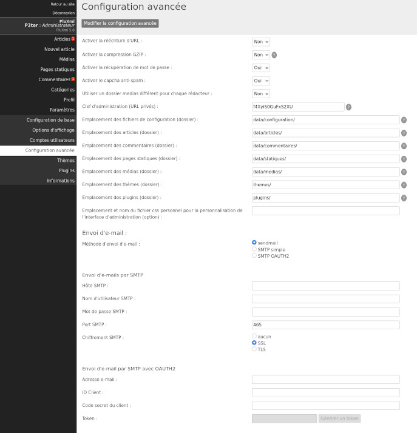

Configuration avancée
=====================

Cette page concerne les paramètres techniques de PluXml, tel que la réécriture d'URL ou l'envoi d'e-mails, par exemple.

Fonctionnement du site
----------------------

**Activer la réécriture d’URL**

La réécriture d’URL (ou URL rewrite en anglais) est un procédé qui donne de plus jolies adresses et qui est excellent pour les moteurs de recherche.

Au lieu d’avoir : http://monsite.net/index.php?artice23/ma-page

Vous aurez : http://monsite.net/artice23/ma-page

Il faut au préalable que la réécriture d’URL soit activée sur votre serveur ou sur votre hébergement. Si cette fonctionnalité n'est pas disponible sur votre hébergeur, laissez l’option sur *Non*.

**Activer la compression GZIP**

Passé à *Oui* cette option permet de compresser les pages et d’économiser de la bande passante, rendant le site plus rapide. Cependant, cela augmente la charge du processeur de la machine qui héberge votre site.

**Activer le captcha antispam**

Permet d'afficher un captcha basique pour sécuriser l’envoi de commentaires sur vos articles. Il est important, pour éviter le spam, de mettre à *Oui* cette option.

**Utiliser un dossier images et documents différent pour chaque utilisateur**

Si vous êtes le seul à travailler dans l’administration de votre site, vous pouvez laisser cette option à *Non*. En revanche, si vous prévoyez d'être plusieurs à intervenir sur le site, il est avantageux d’utiliser cette option pour que chaque utilisateur dispose d'un espace réservé pour gérer ses images.

**Clé d’administration (URL privées)**

Laissez par défaut ou videz le champ pour régénérer la clé. Cette clé est utilisée dans le lien des flux RSS pour protéger l'accès à l’administration des commentaires en ligne et hors ligne.

**Emplacement des fichiers de configuration (dossier)**

Emplacement des fichiers de configuration : par défaut data/configuration/.

**Emplacement des articles (dossier)**

Emplacement du dossier stockant les fichiers des articles : par défaut data/articles/

**Emplacement des commentaires (dossier)**

Emplacement du dossier stockant les fichiers des commentaires : par défaut data/commentaires/

**Emplacement des pages statiques (dossier)**

Emplacement du dossier stockant les fichiers des pages statiques : par défaut /data/statiques/

**Emplacement des médias (dossier)**

Emplacement du dossier stockant les images ou autres documents utilisateurs : par défaut /data/medias/

**Emplacement des thèmes (dossier)**

Emplacement du dossier stockant les thèmes du site : par défaut /themes/

**Emplacement des plugins (dossier)**

Emplacement du dossier stockant les plugins : par défaut /plugins/

**Emplacement et nom du fichier css personnel pour la personnalisation de l’interface d’administration (option)**

Emplacement du fichier css utilisateurs permettant de modifier l’apparence de l’interface d’administration. Exemple : data/admin-theme.css

.. attention::

    Ne pas oublier de mettre un / (slash) à la fin des chemins des dossiers.

Pour valider le paramétrage de cette section, cliquez sur Modifier la configuration avancée.

Envoi d'e-mails
---------------

Cette section permer de configurer l'envoi des e-mails par PluXml. Plusieurs méthodes sont disponibles :

* **sendmail** : utilisation de la configuration locale de l'hébergeur ou du serveur (EXIM4, par exemple). Aucun paramétrage à réaliser dans l'administration de PluXml.
* **SMTP simple** : utilisation d'un serveur externe (OVH, Gandi, par exemple).
    * **Hôte SMTP** : nom du serveur SMTP (exemple : ssl0.ovh.net)
    * **Nom d'utilisateur SMTP** : nom de l'utilisateur sur l'hôte SMTP (exemple : pluxml@monserveursmtp.com)
    * **Mot de passe SMTP** : mot de passe de l'utilisateur sur l'hôte SMTP
    * **Port SMTP** : numéro du port de l'hôte SMTP (par défaut : 465)
    * **Chiffrement SMTP** : protocole de chiffrement à utiliser (SSL, TLS ou aucun)
* **SMTP OAUTH2** : utilisation d'un service externe (compatible uniquement avec GMAIL).
    * **Adresse e-mail** : l'adresse utilisée sur le service OAUTH2 (exemple : pluxml@gmail.com)
    * **ID Client** : identifiant client sur le service OAUTH2 (exemple : 664335625964-uha1vkt20qcvooug81ubjkkgfagktj5d.apps.googleusercontent.com)
    * **Code secret du client** : la clé du client sur le service OAUTH2 (exemple : PrsvKp6aprKdnN9seeCoC8-x)
    * **Token** : token d'authentifiation sur le service OAUTH2 (exemple : )

.. note:: "Compatibilité et génération du token AOUTH2"

    * PluXml est compatible avec le protocole OAUTH2, mais permet de générer des tokens uniquement pour le service GMAIL de Google.
    * L'ID client et le code secret, doivent être créés depuis le fournisseur de service [Google Cloud Plateform](https://cloud.google.com). Le champ "URL de redirection autorisée", doit contenir l'URL de votre site suivi de "/core/admin/get_oauth_token.php" (voir capture d'écran ci-dessous).
    * Une fois l'ID client et le code secret renseignés dans l'administration de PluXml, cliquez sur le bouton "*Modifier la configuration avancée*" pour enregistrer, puis cliquer sur le bouton "*Générer un token*" en bas de page.

    .. image:: img/options-avancees-oauth2.jpg
       :align: center

