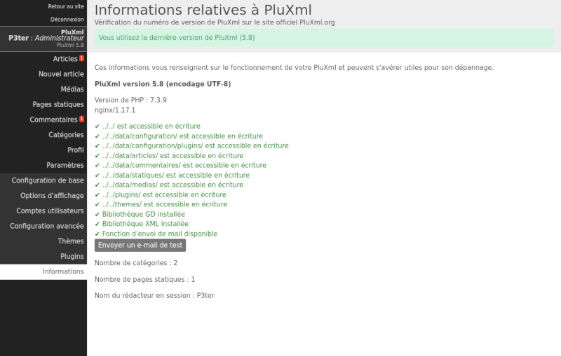

Informations
============

PluXml dispose d’un panneau d’informations vous permettant de vérifier certains points relatifs au bon fonctionnement de PluXml. Pour y accéder, cliquez sur le menu Paramètres, puis sur le menu Informations.

Sur cette page vous pouvez voir :

* Votre version de PluXml
* Le type d’encodage des caractères
* La version PHP de votre serveur et du serveur http utilisé (apache, nginx, ...)
* Le nombre de catégories
* Le nombre de pages statiques
* Le nom du rédacteur en session
* La disponibilité d’une mise à jour de PluXml

En cas d'erreur ou de valeur non supportée, la ligne est affichée en rouge, sinon en vert.

Le bouton *Envoyer un e-mail de test* permet de tester l'envoi des e-mails en se basant sur les paramètres définis dans la page *Configuration avancée*.