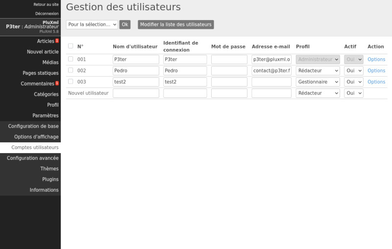

Comptes utilisateurs
====================

PluXml est multi-utilisateurs, ce qui signifie que vous pouvez accueillir une communauté de membres ayant des droits d’utilisation et de gestion différents sur l’ensemble de votre site.

En cliquant sur *Paramètres > Comptes utilisateurs*, vous accédez à la page de gestion des utilisateurs, permettant d'ajouter et de modifier des utilisateurs sous 5 niveaux.

**Les Administrateurs** : ils ont tous les droits sur l’ensemble du site. L’administrateur par défaut est celui qui installe PluXml : ses droits ne peuvent pas être modifiés.

**Les Gestionnaires** : ils ont quasiment les mêmes droits que l’administrateur sauf qu’ils ne peuvent pas modifier les paramètres de PluXml. Certains accès à la configuration des plugins ne sont pas autorisés (en fonction des plugins).

**Les Modérateurs** : ils ont les mêmes droits que les éditeurs et ont aussi accès aux commentaires qu’ils peuvent modérer.

**Les Éditeurs** : ils peuvent accéder à la liste des articles, ajouter des articles, gérer les catégories et les médias.

**Les Rédacteurs** : ils peuvent accéder à la liste de ses articles, ajouter des articles et des médias.

L’édition des articles sera modérée ou non par un utilisateur ayant des droits plus avancés (Administrateur, Gestionnaire, Modérateur) selon le paramétrage de PluXml. La modération des articles des rédacteurs s’active par l’administrateur dans *Paramètres/configuration de base* puis il faut passer à *Oui* le champ *Modérer les articles pour les profils Rédacteur et Éditeur*.

Tous les utilisateurs peuvent modifier leur profil.

Dans la colonne Profils, définissez le statut que vous donnez à un utilisateur (administrateur, gestionnaire, modérateur, ...).

Vue d’ensemble des droits accordés aux différents profils :

.. list-table::
   :widths: 25 15 15 15 15 15
   :header-rows: 1

   * -
     - Articles
     - Catégories
     - Commentaires
     - Pages statiques
     - Paramètres
   * - Administrateur
     - X
     - X
     - X
     - X
     - X
   * - Manager
     - X
     - X
     - X
     - X
     -
   * - Modérateur
     - X
     - X
     - X
     -
     -
   * - Éditeur
     - X
     - X
     -
     -
     -
   * - Rédacteur
     - X
     -
     -
     -
     -

**Changer le mot de passe d’un utilisateur**

Le champ *Mot de passe* permet de modifier le mot de passe d'un utilisateur s’il venait à le perdre par exemple. La couleur du champ indique le niveau de sécurité du mot de passe.

* Rouge : Niveau de sécurité faible
* Jaune : Niveau de sécurité moyen
* Vert : Niveau de sécurité fort

**Supprimer un utilisateur**

L’utilisateur peut être supprimé en cochant sa case dans la colonne N° d’utilisateur puis en sélectionnant Supprimer dans la liste déroulante Pour la sélection et en validant en cliquant sur le bouton OK.

**Activer ou désactiver un profil utilisateur**

La colonne « Actif » vous permet d’activer ou de désactiver un compte utilisateur.

**Options**

Dans la colonne *Options*, vous pouvez modifier la langue utilisée dans l’interface d’administration de ce membre, son adresse e-mail et les informations le concernant.

.. attention::

    N’oubliez pas de valider les modifications de cette section en cliquant sur le bouton *Mettre à jour cet utilisateur*.

