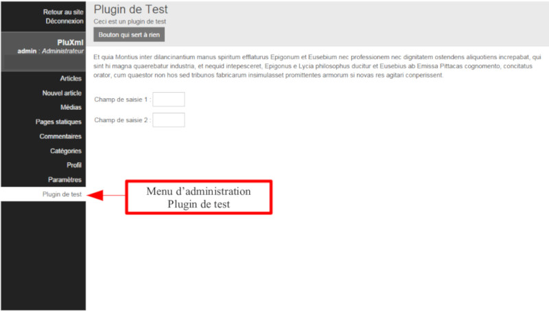

Créer un écran d’administration
===============================
Il est possible d’avoir un écran d’administration réservé à un ou plusieurs profils utilisateur
accédant à l’administration de PluXml. Les droits d’accès sont définis par le développeur du plugin en fonction de ses choix et ceux du plugin.

Création de l'écran d'administration
------------------------------------
Le fichier correspondant à l’écran de configuration s’appelle ``admin.php``. Il est stocké dans le dossier du plugin.
Il n’est pas obligatoire. Si ce fichier est présent, il sera accessible à partir de la barre des menus de gauche (sidebar).
L’affichage du menu tient compte des droits accordés pour accéder à l’écran.

Exemple de menu d’administration : contenu du fichier ``admin.php``

.. code:: html

    <?php if(!defined('PLX_ROOT')) exit; ?>
    <form class="inline-form" action="plugin.php?p=test" method="post" id="form_test">
        

            <h2>Plugin de Test</h2>
            
Ceci est un plugin de test

            <input type="submit" value="Bouton qui sert à rien" />
        

        

            Et quia Montius inter dilancinantium manus spiritum efflaturus Epigonum et Eusebium
        

        <fieldset>
            

                <label for="id_field1">Champ de saisie 1 :</label>
                <?php plxUtils::printInput('field1','','text','4-4') ?>
            

            

                <label for="id_field2">Champ de saisie 2 :</label>
                <?php plxUtils::printInput('field2','','text','4-4') ?>
            

        </fieldset>
    </form>

La première ligne du fichier est indispensable car elle apporte une sécurité au plugin mais aussi à tout PluXml
en interdisant d’appeler et d’exécuter directement le fichier ``admin.php`` sans passer par PluXml.

.. code:: php

    <?php if(!defined('PLX_ROOT')) exit; ?>

- ``class="inline-form"`` : permet d’avoir les champs de formulaire sur une seule ligne (voir documentation de PluCSS, paragraphe “Formulaire”)
- ``class="action-bar"`` : permet d’afficher le contenu de la balise *div* dans la barre d’action en haut de page

Définir les droits d’accès
--------------------------
Les droits d’accès à l’écran d’administration se définissent dans le code du plugin, grâce à l’instruction :

.. code:: php

    <?php $this->setAdminProfil(<profil>); ?>

Les profils disponibles sont définis par les constantes

* PROFIL_ADMIN : administrateur
* PROFIL_MANAGER : gestionnaire
* PROFIL_MODERATOR : modérateur
* PROFIL_EDITOR : éditeur
* PROFIL_WRITER : rédacteur

Plusieurs profils peuvent être spécifiés en les séparant par des virgules :

.. code:: php

    <?php $this->setAdminProfil(PROFIL_ADMIN, PROFIL_WRITER); ?>

Exemple :

.. code:: php

    <?php
        class test extends plxPlugin {
            public function __construct($default_lang) {
                # appel du constructeur de la classe plxPlugin (obligatoire)
                parent::__construct($default_lang);
                # limite l'accès à l'écran d'administration du plugin
                $this->setAdminProfil(PROFIL_MODERATOR);
            }
        }
    ?>

Si les droits autorisant l’accès à l’écran ``admin.php`` ne sont pas précisés ou non valides,
l’utilisateur sera redirigé vers la page ``index.php`` de l’administration avec un message d’erreur « *Accès interdit* ».

Personnaliser le menu d'administration
--------------------------------------
L'affichage du menu pour accéder à l'écran d'administration peut être personnaliser grâce à la méthode ``setAdminMenu``.

Exemple :

.. code:: php

    <?php
        class test extends plxPlugin {
            public function __construct($default_lang) {
                # appel du constructeur de la classe plxPlugin (obligatoire)
                parent::__construct($default_lang);
                # Accès au menu admin réservé au profil administrateur
                $this->setAdminProfil(PROFIL_ADMIN);
                # Personnalisation du menu admin
                $this->setAdminMenu('Titre du menu', 3, 'Légende du lien');
            }
        }
    ?>

La méthode ``setAdminMenu`` accepte 3 paramètres :

.. list-table::
   :widths: 25 15 60
   :header-rows: 1

   * - Paramètres
     - Nom
     - Description
   * - 1er paramètre
     - ``title``
     - titre du menu
   * - 2ième paramètre
     - ``position``
     - position du menu dans la sidebar
   * - 3ième paramètre
     - ``caption``
     - légende du menu (balise title du lien)

Il peut être intéressant d'offrir à l'utilisateur la possibilité de paramétrer le comportement du menu à partir
de l'écran de configuration du plugin, en sauvegardant et en utilisant ses préférences dans le fichier des paramètres du plugin ``parameters.xml``.

Exemple :

.. code:: php

    <?php
        class test extends plxPlugin {
            public function __construct($default_lang) {
                # appel du constructeur de la classe plxPlugin (obligatoire)
                parent::__construct($default_lang);
                # Accès au menu admin réservé au profil administrateur
                $this->setAdminProfil(PROFIL_ADMIN);
                # Personnalisation du menu admin
                $this->setAdminMenu($this->getParam('menuName'), $this->getParam('menuPos'), $this->getParam('mnuCaption'));
            }
        }
    ?>
