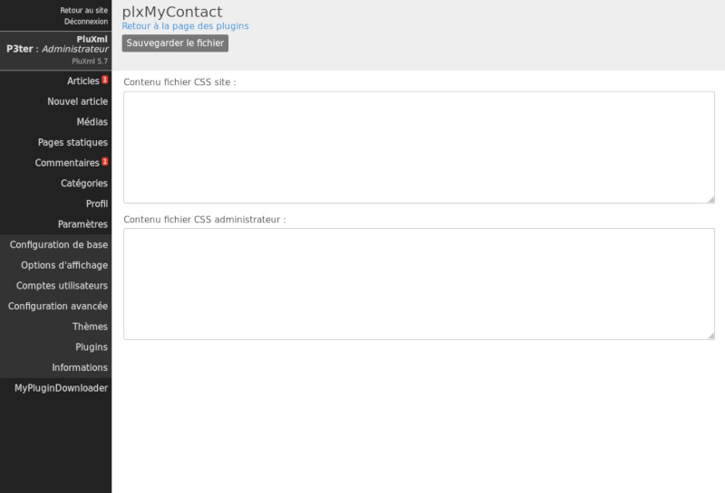

Aide et configuration d'un plugin
=================================
Suivant les plugins, les liens *Aide* et *Configuration* peuvent exister dans l'écran **Gestion des plugins** de l'administration.

Si un fichier ``config.php`` existe dans le dossier du plugin, le lien *Configuration* est visible et permet d’accéder à l’écran de configuration du plugin.

Si un fichier d’aide existe dans le dossier ``lang`` du plugin, le lien *Aide* est visible et permet d’accéder à l’écran d’affichage de l’aide du plugin.

Le nom du fichier d’aide utilisé dépend de la langue utilisé par PluXml.
Si PluXml est configuré pour utiliser la langue anglaise (en), le fichier ``lang/en-help.php`` dans le dossier du plugin
sera utilisé et affiché (si le fichier existe). Pour une aide en français le fichier ``fr-help.php`` doit exister.

Le menu *Code css* permet de définir du code CSS qui sera utilisé par le plugin coté utilisateur et/ou coté administration.

Le code CSS est mis en cache dans les fichiers :

* ``/data/site.css`` pour la partie visiteur
* ``/data/admin.css`` pour la partie administration

.. note::

    Si aucun code n’est présent pour au moins un plugin, les fichiers CSS de cache n’existe pas.

L’utilisation de ce paramétrage permet à l’administrateur du site de définir le code CSS nécessaire au fonctionnement des plugins,
indépendamment de celui définit et codé en dur par le développeur dans le ``core`` du plugin.

Pour initialiser le contenu des zones de saisie *Contenu fichier css site* et *Contenu fichier css administrateur*,
créer les fichiers CSS suivants dans le dossier de votre plugin :

- ``/plugins/monplugin/css/site.css``
- ``/plugins/monplugin/css/admin.css``

Si l’un de ces fichiers existe et contient du code CSS, il sera affiché dans les zones textes de saisies correspondantes.
Le contenu des zones pourra être modifié par l’utilisateur. Les modifications seront mises dans les fichiers CSS en cache,
sans altérer les fichiers CSS d’origine stockés dans ``/plugins/monplugin/css/``

