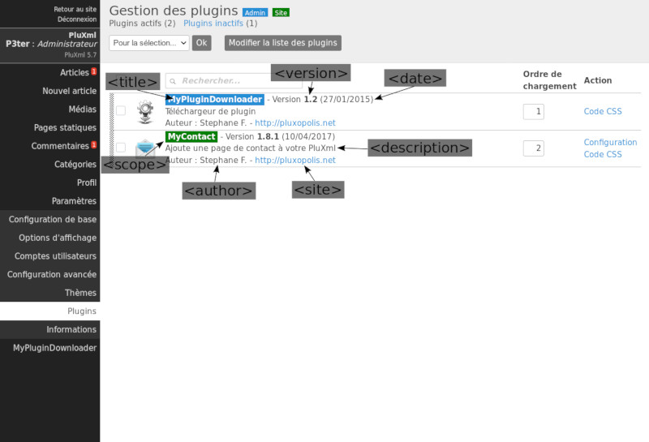

Fichier infos.xml
=================
Le fichier ``infos.xml`` contient les données utilisées pour identifier le plugin sur la page de gestion des Plugins.

Structure XML du fichier
------------------------

Exemple :

.. code:: xml

    <?xml version="1.0" encoding="UTF-8"?>
    <document>
        <title><![CDATA[Plugin de test]]></title>
        <author><![CDATA[Stéphane F.]]></author>
        <version>1.0</version>
        <date>01/12/2010</date>
        <site>http://pluxml.org</site>
        <description><![CDATA[Plugin de test pour PluXml]]></description>
        <scope>admin</scope>
    </document>

Description des balises
-----------------------

.. list-table::
   :widths: 15 70 15
   :header-rows: 1

   * - Balises
     - Description
     - Format
   * - ``title``
     - Titre du plugin
     - ``cdata``
   * - ``author``
     - Nom de l'auteur du plugin
     - ``cdata``
   * - ``version``
     - Numéro de version du plugin
     - ``string``
   * - ``date``
     - Date de création ou de mise à jour du plugin
     - ``string``
   * - ``site``
     - Site de l’auteur du plugin
     - ``string``
   * - ``description``
     - Description du plugin
     - ``cdata``
   * - ``scope``
     - Prend la valeur ``admin`` ou ``site`` et permet de charger le plugin uniquement dans le contexte indiqué. Si absent ou vide, le plugin sera chargé dans les deux cas
     - ``string``

Utilisation des données du fichier infos.xml
--------------------------------------------
Les données du fichier ``infos.xml`` sont utilisées essentiellement sur l’écran de **Gestion des plugins**. Chaque donnée des balises XML sont utilisées de la manière suivantes :

