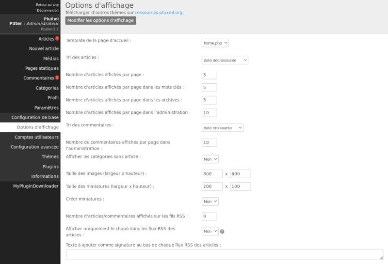

Options d’affichage
===================

C’est ici que vous paramétrez l’affichage des pages sur votre site.

**Template de la page d'accueil**
Permet de définir un template spécifique à la page d'accueil de votre site.

.. note::

    Voir la section : `Les Templates`_

**Tri des articles**

Par défaut à l’affichage, les articles apparaissent par ordre chronologique, vous pouvez les afficher par date croissante, date décroissante ou bien par ordre alphabétique.

**Nombre d’articles affichés par page**

Indiquez le nombre d’articles à afficher par page.

**Nombre d'articles affichés par page dans les mots clés**

Indiquez le nombre d’articles à afficher par page d’un mot clé.

**Nombre d’articles affichés par page dans les archives**

Indiquez le nombre d’articles à afficher par page dans les archives.

**Nombre d’articles affichés par page dans l’administration**

Indiquez le nombre d’articles à afficher par page dans l’administration de PluXml.

**Tri des commentaires**

Tri des commentaires par date croissante ou décroissante.

**Nombre de commentaires affichés par page dans l’administration**

Permet de définir le nombre de commentaires à afficher par page dans la section Commentaires de l’administration de PluXml.

**Afficher les catégories sans articles**

Par défaut le nom des catégories qui ne contiennent pas d'articles n'est pas affiché sur la partie publique du site. Pour afficher dans tous les cas le nom des catégories, sélectionnez la valeur *Oui* dans la liste déroulante.

.. note::

    Voir la section : `Les Catégories`_

**Taille des images et des miniatures (largeur x hauteur)**

Lors de l'envoi d'images sur votre site à partir du gestionnaire de médias, une miniature de l'image peut être créée. Parmi les valeurs proposées vous pouvez définir ici un réglage personnel en définissant une largeur et une hauteur. Ce paramétrage sera affiché dans le gestionnaire de médias.

.. note::

    Voir la section : `Gestionnaire de médias`_

**Créer miniatures**

Si réglé sur *Oui*, le système créera automatiquement des miniatures lors de l'envoi d’images avec le gestionnaire de médias.

.. note::

    Voir la section : `Gestionnaire de médias`_

**Nombre d’articles/commentaires affichés sur les fils RSS**

Permet de définir le nombre d’articles et de commentaires dans les flux RSS que propose votre site.

**Afficher uniquement le chapô dans les flux RSS des articles**

Permet de n'afficher que le contenu du chapô de vos articles dans les flux RSS proposés par votre site.
.. note::

    Voir la section : `Les Articles`_

**Texte à ajouter comme signature au bas de chaque flux RSS des articles**

Vous pouvez ici rajouter un texte, une signature, un lien ou un slogan, qui sera affiché à la fin de chaque article dans les flux RSS que propose votre site.

.. attention::

    N’oubliez pas de valider après les paramétrages de cette section en cliquant sur *Modifier les options d’affichage*.

