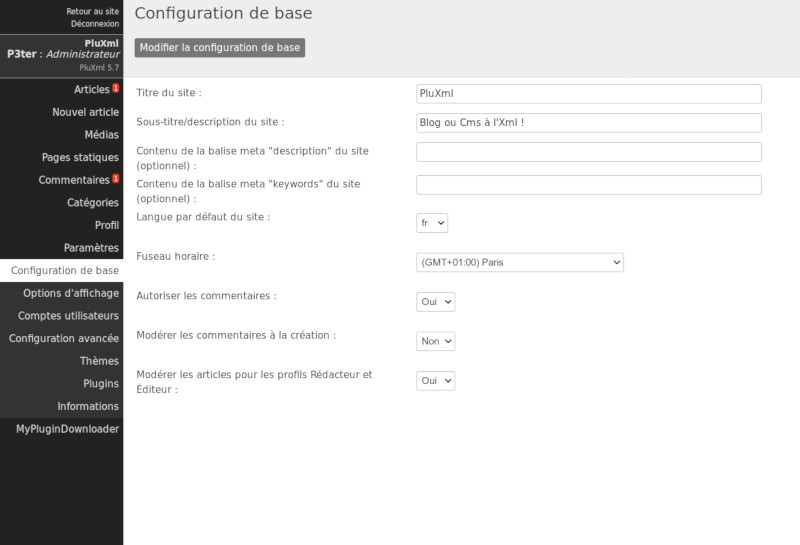
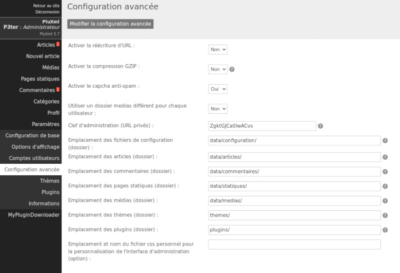
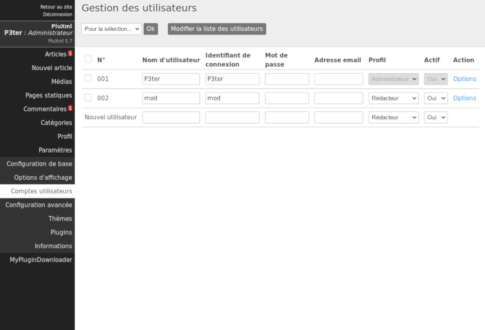
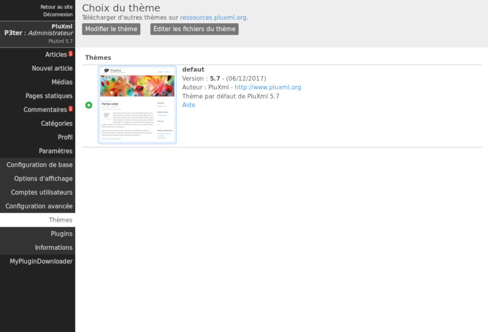
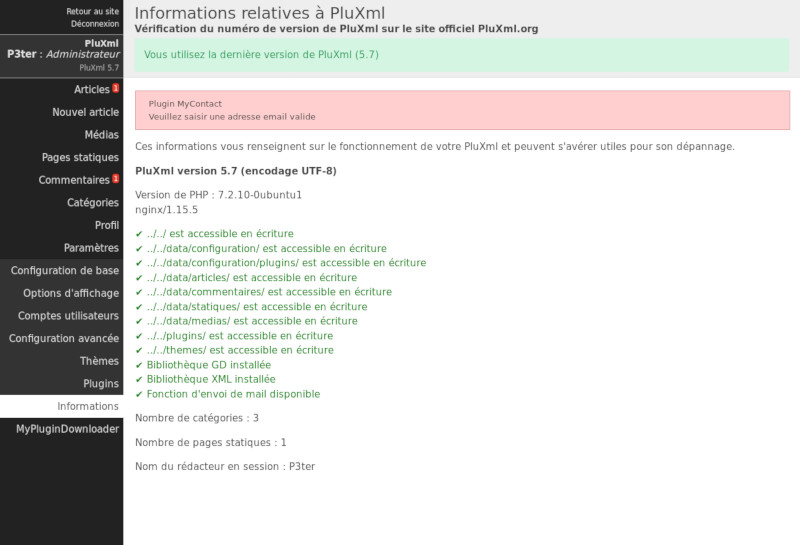
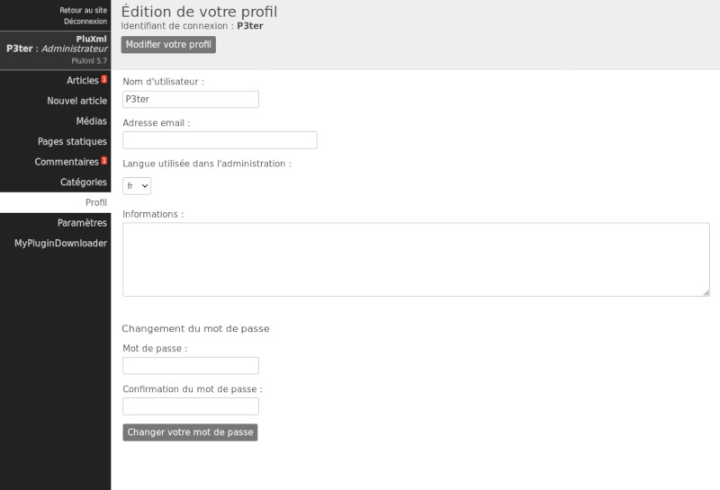

# Personnalisation et paramétrage de PluXml
Une des premières choses à faire après la première connexion à la zone d'administration est de renseigner les paramètres de base.
Dans le menu de gauche, cliquez sur Paramètres. Un sous-menu s’ouvre alors.

## Configuration de base

__Titre du site__

Ce champ facultatif permet de définir le titre du site.

__Sous-titre/description du site__

Ce champ facultatif permet de renseigner un sous-titre au site comme une brève description ou un slogan.

__Contenu de la balise meta « description » du site (optionnel)__

Une description du site destinée aux moteurs de recherche.

__Contenu de la balise meta « keywords » du site (optionnel)__

Des keywords (ou mots clés) destinés aux moteurs de recherche. Ces mots clés concernent votre site de manière générale. À ne pas confondre avec les mots clés spécifiques à chaque page ou article.

__Langue par défaut du site__

Langue par défaut utilisée dans l'administration du site ou si vous utilisez un thème multi-langues.

__Fuseau horaire__

Fuseau horaire pour prendre en compte le décalage date/heure en fonction du pays.

__Autoriser les commentaires__

* Non : les commentaires sont désactivés sur l'ensemble site. Le formulaire de rédaction des commentaires n’apparaît pas.
* Oui : les commentaires sont autorisés sur tous les articles.

__Modérer les commentaires à la création__

* Non : Tous les nouveaux commentaires sont publiés automatiquement.
* Oui : Avant d’être publiés, les commentaires doivent être validés par un utilisateur disposant des droits suffisants.

!!! note
    Voir la section : Les Comptes utilisateurs

__Modérer les articles pour les profils Rédacteur et Éditeur__

Activée, cette fonction permettra à l’administrateur du site de publier (ou non) les articles proposés par les rédacteurs.

!!! note
    Voir la section : Les Comptes utilisateurs

## Options d’affichage
C’est ici que vous paramétrez l’affichage des pages sur votre site.

__Template de la page d'accueil__
Permet de définir un template spécifique à la page d'accueil de votre site.

!!! note
    Voir la section : Les Templates

__Tri des articles__

Par défaut à l’affichage, les articles apparaissent par ordre chronologique, vous pouvez les afficher par date croissante, date décroissante ou bien par ordre alphabétique.

__Nombre d’articles affichés par page__

Indiquez le nombre d’articles à afficher par page.

__Nombre d'articles affichés par page dans les mots clés__

Indiquez le nombre d’articles à afficher par page d’un mot clé.

__Nombre d’articles affichés par page dans les archives__

Indiquez le nombre d’articles à afficher par page dans les archives.

__Nombre d’articles affichés par page dans l’administration__

Indiquez le nombre d’articles à afficher par page dans l’administration de PluXml.

__Tri des commentaires__

Tri des commentaires par date croissante ou décroissante.

__Nombre de commentaires affichés par page dans l’administration__

Permet de définir le nombre de commentaires à afficher par page dans la section Commentaires de l’administration de PluXml.

__Afficher les catégories sans articles__

Par défaut le nom des catégories qui ne contiennent pas d'articles n'est pas affiché sur la partie publique du site. Pour afficher dans tous les cas le nom des catégories, sélectionnez la valeur *Oui* dans la liste déroulante.

!!! note
    Voir la section : Les Catégories

__Taille des images et des miniatures (largeur x hauteur)__

Lors de l'envoi d'images sur votre site à partir du gestionnaire de médias, une miniature de l'image peut être créée. Parmi les valeurs proposées vous pouvez définir ici un réglage personnel en définissant une largeur et une hauteur. Ce paramétrage sera affiché dans le gestionnaire de médias.

!!! note
    Voir la section : Gestionnaire de médias

__Créer miniatures__

Si réglé sur *Oui*, le système créera automatiquement des miniatures lors de l'envoi d’images avec le gestionnaire de médias.

!!! note
    Voir la section : Gestionnaire de médias

__Nombre d’articles/commentaires affichés sur les fils RSS__

Permet de définir le nombre d’articles et de commentaires dans les flux RSS que propose votre site.

__Afficher uniquement le chapô dans les flux RSS des articles__

Permet de n'afficher que le contenu du chapô de vos articles dans les flux RSS proposés par votre site.
!!! note
    Voir la section : Les Articles

__Texte à ajouter comme signature au bas de chaque flux RSS des articles__

Vous pouvez ici rajouter un texte, une signature, un lien ou un slogan, qui sera affiché à la fin de chaque article dans les flux RSS que propose votre site.

!!! danger "Important"
    N’oubliez pas de valider après les paramétrages de cette section en cliquant sur *Modifier les options d’affichage*.

## Configuration avancée

__Activer la réécriture d’URL__

La réécriture d’URL (ou URL rewrite en anglais) est un procédé qui donne de plus jolies adresses et qui est excellent pour les moteurs de recherche.

Au lieu d’avoir : http://monsite.net/index.php?artice23/ma-page

Vous aurez : http://monsite.net/artice23/ma-page

Il faut au préalable que la réécriture d’URL soit activée sur votre serveur ou sur votre hébergement. Si cette fonctionnalité n'est pas disponible sur votre hébergeur, laissez l’option sur *Non*.

__Activer la compression GZIP__

Passé à *Oui* cette option permet de compresser les pages et d’économiser de la bande passante, rendant le site plus rapide. Cependant, cela augmente la charge du processeur de la machine qui héberge votre site.

__Activer le captcha antispam__

Permet d'afficher un captcha basique pour sécuriser l’envoi de commentaires sur vos articles. Il est important, pour éviter le spam, de mettre à *Oui* cette option.

__Utiliser un dossier images et documents différent pour chaque utilisateur__

Si vous êtes le seul à travailler dans l’administration de votre site, vous pouvez laisser cette option à *Non*. En revanche, si vous prévoyez d'être plusieurs à intervenir sur le site, il est avantageux d’utiliser cette option pour que chaque utilisateur dispose d'un espace réservé pour gérer ses images.

__Clé d’administration (URL privées)__

Laissez par défaut ou videz le champ pour régénérer la clé. Cette clé est utilisée dans le lien des flux RSS pour protéger l'accès à l’administration des commentaires en ligne et hors ligne.

__Emplacement des fichiers de configuration (dossier)__

Emplacement des fichiers de configuration : par défaut data/configuration/.

__Emplacement des articles (dossier)__

Emplacement du dossier stockant les fichiers des articles : par défaut data/articles/

__Emplacement des commentaires (dossier)__

Emplacement du dossier stockant les fichiers des commentaires : par défaut data/commentaires/

__Emplacement des pages statiques (dossier)__

Emplacement du dossier stockant les fichiers des pages statiques : par défaut /data/statiques/

__Emplacement des médias (dossier)__

Emplacement du dossier stockant les images ou autres documents utilisateurs : par défaut /data/medias/

__Emplacement des thèmes (dossier)__

Emplacement du dossier stockant les thèmes du site : par défaut /themes/

__Emplacement des plugins (dossier)__

Emplacement du dossier stockant les plugins : par défaut /plugins/

__Emplacement et nom du fichier css personnel pour la personnalisation de l’interface d’administration (option)__

Emplacement du fichier css utilisateurs permettant de modifier l’apparence de l’interface d’administration. Exemple : data/admin-theme.css

!!! danger "Important"
    Ne pas oublier de mettre un / (slash) à la fin des chemins des dossiers.

Pour valider le paramétrage de cette section, cliquez sur Modifier la configuration avancée.

## Comptes utilisateurs
PluXml est multi-utilisateurs, ce qui signifie que vous pouvez accueillir une communauté de membres ayant des droits d’utilisation et de gestion différents sur l’ensemble de votre site.

En cliquant sur *Paramètres > Comptes utilisateurs*, vous accédez à la page de gestion des utilisateurs, permettant d'ajouter et de modifier des utilisateurs sous 5 niveaux.

__Les Administrateurs__ : ils ont tous les droits sur l’ensemble du site. L’administrateur par défaut est celui qui installe PluXml : ses droits ne peuvent pas être modifiés.

__Les Gestionnaires__ : ils ont quasiment les mêmes droits que l’administrateur sauf qu’ils ne peuvent pas modifier les paramètres de PluXml. Certains accès à la configuration des plugins ne sont pas autorisés (en fonction des plugins).

__Les Modérateurs__ : ils ont les mêmes droits que les éditeurs et ont aussi accès aux commentaires qu’ils peuvent modérer.

__Les Éditeurs__ : ils peuvent accéder à la liste des articles, ajouter des articles, gérer les catégories et les médias.

__Les Rédacteurs__ : ils peuvent accéder à la liste de ses articles, ajouter des articles et des médias.

L’édition des articles sera modérée ou non par un utilisateur ayant des droits plus avancés (Administrateur, Gestionnaire, Modérateur) selon le paramétrage de PluXml. La modération des articles des rédacteurs s’active par l’administrateur dans *Paramètres/configuration de base* puis il faut passer à *Oui* le champ *Modérer les articles pour les profils Rédacteur et Éditeur*.

Tous les utilisateurs peuvent modifier leur profil.

|  | Articles | Catégories | Commentaires | Pages statiques | Paramètres |  
|--|--|--|--|--|--|
| Administrateur | X | X | X | X | X |
| Manager | X | X | X | X |  |
| Modérateur | X | X | X |  |  |
| Éditeur | X | X |  |  |  |
| Rédacteur | X |  |  |  |  |

*Vue d’ensemble des droits accordés aux différents profils*

Dans la colonne Profils, définissez le statut que vous donnez à un utilisateur (administrateur, gestionnaire, modérateur, ...).

__Changer le mot de passe d’un utilisateur__

Le champ *Mot de passe* permet de modifier le mot de passe d'un utilisateur s’il venait à le perdre par exemple. La couleur du champ indique le niveau de sécurité du mot de passe.

* Rouge : Niveau de sécurité faible
* Jaune : Niveau de sécurité moyen
* Vert : Niveau de sécurité fort

__Supprimer un utilisateur__

L’utilisateur peut être supprimé en cochant sa case dans la colonne N° d’utilisateur puis en sélectionnant Supprimer dans la liste déroulante Pour la sélection et en validant en cliquant sur le bouton OK.

__Activer ou désactiver un profil utilisateur__

La colonne « Actif » vous permet d’activer ou de désactiver un compte utilisateur.

__Options__

Dans la colonne *Options*, vous pouvez modifier la langue utilisée dans l’interface d’administration de ce membre, son adresse e-mail et les informations le concernant.

!!! danger "Important"
  N’oubliez pas de valider après les paramétrages de cette section en cliquant sur Mettre à jour cet utilisateur.

## Thèmes
Depuis cette page vous pouvez choisir le thème à appliquer sur votre site.

Pour cela, sélectionner le thème en cochant puis cliquez sur le bouton *Modifier les options d’affichage*.

Le lien *Éditer les fichiers du thème* permet de modifier le contenu des fichiers du thème sélectionné.

Le thème par défaut livré avec PluXml defaut est codé en HTML5 et est Responsive Design, c’est-à-dire que l'affichage s'adapte à la taille des écrans, y compris celle des tablettes et des smartphones. Il est parfait pour débuter car facilement modifiable pour le personnaliser.

Le thème en cours d’utilisation est toujours affiché en début de liste et est entouré d’un cadre bleu.

!!! note
    Télécharger d’autres thèmes sur ressources.pluxml.org. Le site PluXml.org vous propose une bibliothèque de thèmes que vous pouvez télécharger et adapter selon vos besoins. Les utilisateurs proposent aussi une multitude de thèmes sur le forum de PluXml.org dans la section *Vos créations (forum.pluxml.org)*.

!!! danger "Important
PluXml étant en perpétuelle évolution, certains thèmes un peu anciens ne sont plus compatibles avec la dernière version que vous venez de télécharger (sauf adaptations toujours possibles). Nous vous recommandons de tester vos thèmes sur un PluXml de « test ».

Pour installer un thème : décompressez l’archive du thème dans le dossier theme qui se trouve à la racine de votre PluXml.
!!! note
    Voir la section : L’Arborescence de PluXml
    Voir la section : Les Thèmes

## Plugins
Un plugin est un module qui vient ajouter une ou plusieurs fonctionnalités à votre site. Cette page fait la liste des différents plugins installés et vous permet notamment d’activer, de désactiver et de configurer vos plugins.

### Installer un plugin
Pour installer un plugin :

* Rendez-vous sur ressources.pluxml.org
* Puis au choix sur Plugins Officiels ou Plugins non officiels
* Téléchargez le plugin de votre choix.
* Décompressez le fichier .zip.
* Déposez le dossier du plugin sur votre espace Web par FTP (ou autre méthode) dans le répertoire plugins de votre installation de PluXml.

En plus des plugins officiels, la communauté vous propose ses propres plugins. Ils vous permettent d’étendre les fonctionnalités de PluXml.

!!! note
    Voir la section Plugins du forum de PluXml : http://forum.pluxml.org

### Activer ou désactiver un plugin.
Après avoir placé le dossier de votre plugin dans le répertoire plugins de votre PluXml, il ne vous reste plus qu’à l’activer :

* Connectez-vous à l’administration de votre site, cliquez sur le menu Paramètres, puis sur le menu Plugins.
* Cochez la case devant le plugin que vous souhaitez activer ou désactiver.
* Dans le menu déroulant nommé Pour la sélection, sélectionnez Activer ou Désactiver
* Cliquez sur le bouton Ok pour valider.

### Écran de configuration
Certains plugins disposent d’un écran de configuration vous permettant de paramétrer le plugin. Un lien nommé Configuration apparaît dans la colonne Action. Cliquez sur ce lien pour accéder à l'écran de configuration du plugin.

Certains plugins proposent une aide. Un lien nommé *Aide* apparaît dans la colonne Action.

!!! danger "Important"
    Certains plugins nécessitent d’être paramétrés avant d’être activé. Pour rappel, essayez toujours un nouveau plugin sur un site de test. Assurez-vous que les plugins qui vous intéressent soient toujours maintenus et à jour avec la dernière version de PluXml.

### Ordre de chargement
PluXml offre la possibilité de charger vos plugins dans un ordre précis : pour cela, cliquez sur le menu *Paramètres*, puis sur le menu Plugins, et repérez la colonne nommée *Ordre de chargement*. Sur la ligne correspondant au plugin que vous souhaitez modifier, saisissez une valeur numérique, puis cliquez sur le bouton *Modifier* la liste des plugins pour valider vos changements.

Vous pouvez également changer l'ordre de chargement des plugins par *drag and drop*. Cliquez et maintenez le clic sur le plugin à déplacer, puis glissez celui-ci vers le haut ou le bas en fonction de la position que vous souhaitez lui donner.

Notez que pour certains plugins, il est nécessaire de les charger dans un ordre précis : pour en savoir plus, consultez la page Aide de votre plugin.

!!! note
    Conseil : si besoin chargez le plugin jQuery en premier.

### Chargement des plugins en fonction du contexte
Certains plugins ne s'appliquant que sur l'admin de PluXml il n'est pas nécessaire de le charge sur le site accessible aux visiteurs. Inversement, un plugin qui ne s'applique que sur le site, n'a pas de nécessité à être chargé dans l'admin de PluXml.

Cette option (*scope*) est définie par le développeur du plugin et est visible dans l'admin au niveau du nom du plugin. Les plugins dont le nom est sur fond bleu sont chargés uniquement dans l'administration. Les plugins dont le nom est sur fond vert sont chargés uniquement sur le site.

Dans le cas d'un plugin dont le nom n'a aucune couleur de fond, alors il sera chargé sur l'administration et sur le site.

!!! note
    Voir la documentation du fichier [infos.xml](//wiki.pluxml.org/developper/developpement/#fichier-infosxml), qui permet de définir la variable *scope*.

### Supprimer un plugin
Pour supprimer un plugin, cliquez sur le menu Paramètres, puis sur le menu Plugins, et repérez la ligne correspondant au plugin que vous souhaitez supprimer. Cochez la case devant le plugin, utilisez le menu déroulant nommé Pour la sélection et sélectionnez Supprimer. Cliquez sur le bouton Ok pour valider votre changement.

### Développer un plugin
Si vous souhaitez développer vos propres plugins, nous vous invitons à télécharger *Le Guide Du Développeur* disponible sur la page Développer de la documentation de PluXml (https:///wiki.pluxml.org).

### Informations
PluXml dispose d’un panneau d’informations vous permettant de vérifier certains points relatifs au bon fonctionnement de PluXml. Pour y accéder, cliquez sur le menu Paramètres, puis sur le menu Informations.

Sur cette page vous pouvez voir :

* Votre version de PluXml
* Le type d’encodage des caractères
* La version PHP de votre serveur et du serveur http utilisé (apache, nginx, ...)
* Le nombre de catégories
* Le nombre de pages statiques
* Le nom du rédacteur en session
* La disponibilité d’une mise à jour de PluXml

En cas d'erreur ou de valeur non supportée, la ligne est affichée en rouge, sinon en vert.

## Éditer son profil
Cliquez sur le lien Profil dans le menu principal de l’administration pour ouvrir cette page. Elle vous permet d’éditer votre profil personnel et de compléter celui-ci au besoin.

### Changer ses informations personnelles
Vous pouvez éditer :

* Votre nom d’utilisateur : celui qui apparaît en ligne quand vous rédigez des articles ou quand vous réagissez à des commentaires. Attention : ce n’est pas votre identifiant de connexion qui ne peut être changé que par un Administrateur.
* Votre adresse e-mail : Vous pouvez renseigner votre adresse e-mail ou la modifier.
* La langue de l’interface administration : Vous pouvez changer la langue de votre interface d’administration (sans modifier la langue du site en ligne).
* Vos informations : Cette partie est libre, vous pouvez rajouter toutes les informations que vous souhaitez. C’est en quelque sorte un espace « signature » qui permet de vous exprimer. Le contenu de cette zone pourra être affiché en signature des articles sur votre site, si le thème du site utilisé le permet.

### Modifier son mot de passe
Vous pouvez modifier votre mot de passe de connexion à l’interface d’administration. En cas de problème, vous devez contacter l’administrateur du site.

La couleur du champ indique le niveau de sécurité du mot de passe.

* Rouge : Niveau de sécurité faible
* Jaune : Niveau de sécurité moyen
* Vert : Niveau de sécurité fort

# Vérifier si une nouvelle mise à jour de PluXml est disponible
Pour vérifier l’existence d’une nouvelle version de PluXml, connectez-vous à votre administration, cliquez sur le menu Paramètres, puis sur le menu Informations. En bas de cette page, PluXml vous indiquera si une nouvelle version est disponible sur le site officiel PluXml.org.

# Les templates
## Les templates pour les articles
Chacun de vos articles peut utiliser son propre template (si votre thème le propose). Par exemple, sur le thème par défaut de PluXml, vous avez la possibilité de choisir de présenter votre article en pleine page, avec ou sans le bandeau de droite appelé sidebar. Vous disposez des templates article-full-width.php et article.php.

Pour choisir un template d'article, éditez un article, puis dans la colonne des options, sélectionnez dans la liste déroulante Template le nom du template à utiliser. Cliquez sur le bouton Publier pour valider vos changements.

## Les templates pour les pages statiques
Chacune de vos pages statiques peut utiliser son propre template (si votre thème le propose) : par exemple, sur le thème par défaut, vous avez la possibilité de choisir de présenter votre page en pleine page, avec ou sans la sidebar.

Les templates disponibles sont nommés static-full-width.php et static.php. Pour modifier le template utilisé pour une page statique, accédez à la page permettant de modifier le contenu de la page statique, puis dans la liste déroulante Template, choisissez le nom du template à appliquer. Pour valider le changement, cliquez sur le bouton Enregistrer cette page statique.

## Les templates pour les catégories
Chacune de vos catégories peut utiliser son propre template (si votre thème le propose). Pour modifier le template d’une de vos catégories, cliquez sur le menu Catégories, repérez la ligne correspondant à la catégorie que vous souhaitez modifier. Cliquez sur le lien Options. Dans la liste déroulante Template, sélectionnez le nom du template à appliquer. Pour valider le changement, cliquez sur le bouton Mettre à jour cette catégorie.
