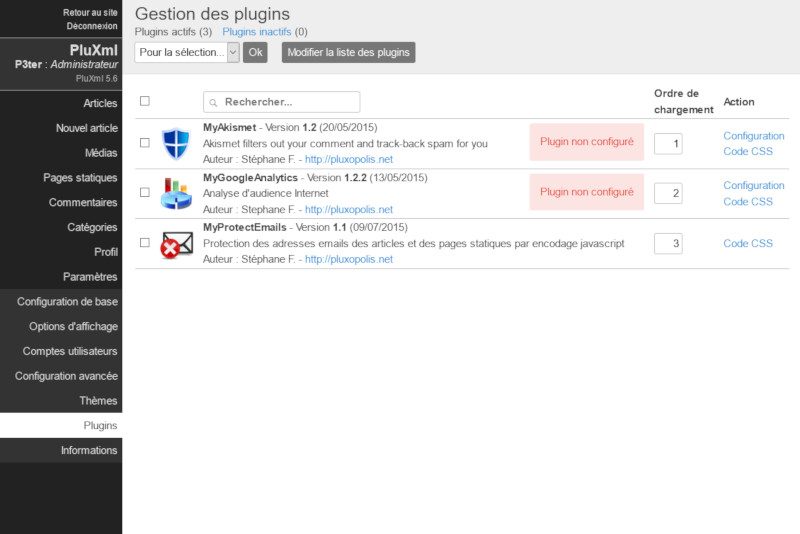

Plugins
=======

Un plugin est un module qui vient ajouter une ou plusieurs fonctionnalités à votre site. Cette page fait la liste des différents plugins installés et vous permet notamment d’activer, de désactiver et de configurer vos plugins.

Installer un plugin
-------------------

Pour installer un plugin :

* Rendez-vous sur https://ressources.pluxml.org
* Puis au choix sur Plugins Officiels ou Plugins non officiels
* Téléchargez le plugin de votre choix.
* Décompressez le fichier .zip.
* Déposez le dossier du plugin sur votre espace Web par FTP (ou autre méthode) dans le répertoire plugins de votre installation de PluXml.

En plus des plugins officiels, la communauté vous propose ses propres plugins. Ils vous permettent d’étendre les fonctionnalités de PluXml.

.. note::

     Voir l'espace `Ressources <https://ressources.pluxml.org>`_

     Voir la section *Plugins* du forum : http://forum.pluxml.org

Activer ou désactiver un plugin
-------------------------------

Après avoir placé le dossier de votre plugin dans le répertoire plugins de votre PluXml, il ne vous reste plus qu’à l’activer :

* Connectez-vous à l’administration de votre site, cliquez sur le menu Paramètres, puis sur le menu Plugins.
* Cochez la case devant le plugin que vous souhaitez activer ou désactiver.
* Dans le menu déroulant nommé Pour la sélection, sélectionnez Activer ou Désactiver
* Cliquez sur le bouton Ok pour valider.

Écran de configuration
----------------------

Certains plugins disposent d’un écran de configuration vous permettant de paramétrer le plugin. Un lien nommé Configuration apparaît dans la colonne Action. Cliquez sur ce lien pour accéder à l'écran de configuration du plugin.

Certains plugins proposent une aide. Un lien nommé *Aide* apparaît dans la colonne Action.

.. attention::

    Certains plugins nécessitent d’être paramétrés avant d’être activé. Pour rappel, essayez toujours un nouveau plugin sur un site de test. Assurez-vous que les plugins qui vous intéressent soient toujours maintenus et à jour avec la dernière version de PluXml.

Ordre de chargement
-------------------

PluXml offre la possibilité de charger vos plugins dans un ordre précis : pour cela, cliquez sur le menu *Paramètres*, puis sur le menu Plugins, et repérez la colonne nommée *Ordre de chargement*. Sur la ligne correspondant au plugin que vous souhaitez modifier, saisissez une valeur numérique, puis cliquez sur le bouton *Modifier la liste des plugins* pour valider vos changements.

Vous pouvez également changer l'ordre de chargement des plugins par *drag and drop*. Cliquez et maintenez le clic sur le plugin à déplacer, glissez celui-ci vers le haut ou le bas en fonction de la position que vous souhaitez lui donner, puis cliquez sur le bouton *Modifier la liste des plugins* pour valider vos changements.

Notez que pour certains plugins, il est nécessaire de les charger dans un ordre précis : pour en savoir plus, consultez la page Aide de votre plugin.

.. note::

    Conseil : si besoin chargez le plugin jQuery en premier.

Chargement des plugins en fonction du contexte
----------------------------------------------

Certains plugins ne s'appliquant que sur l'admin de PluXml il n'est pas nécessaire de le charge sur le site accessible aux visiteurs. Inversement, un plugin qui ne s'applique que sur le site, n'a pas de nécessité à être chargé dans l'admin de PluXml.

Cette option (*scope*) est définie par le développeur du plugin et est visible dans l'admin au niveau du nom du plugin. Les plugins dont le nom est sur fond bleu sont chargés uniquement dans l'administration. Les plugins dont le nom est sur fond vert sont chargés uniquement sur le site.

Dans le cas d'un plugin dont le nom n'a aucune couleur de fond, alors il sera chargé sur l'administration et sur le site.

.. note::

    Voir la documentation du fichier :doc:`infos.xml <dev>`, qui permet de définir la variable *scope*.

Supprimer un plugin
-------------------

Pour supprimer un plugin, cliquez sur le menu Paramètres, puis sur le menu Plugins, et repérez la ligne correspondant au plugin que vous souhaitez supprimer. Cochez la case devant le plugin, utilisez le menu déroulant nommé Pour la sélection et sélectionnez Supprimer. Cliquez sur le bouton Ok pour valider votre changement.

Développer un plugin
--------------------

Si vous souhaitez développer vos propres plugins, nous vous invitons à télécharger *Le Guide Du Développeur* disponible sur la page Développer de la documentation de PluXml (https:///wiki.pluxml.org).
