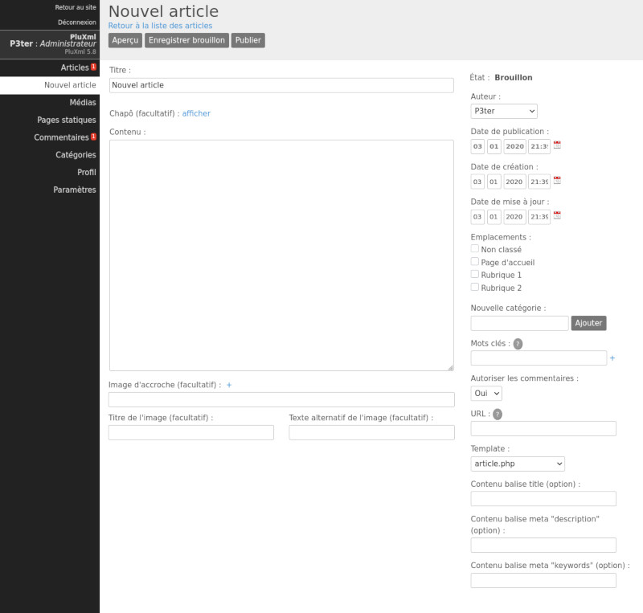

Gérer les articles
==================

La liste des articles
---------------------

La page *Articles* liste tous vos articles, qu’ils soient en cours de rédaction, publiés, brouillons, ou en attente de validation.

.. image:: img/liste-articles.jpg
   :align: center

**Articles publiés**

Vos articles en ligne et publiés. Vous pouvez les modifier, les classer et les retravailler si besoin.

**Brouillons**

Vos articles en cours de rédaction. Ces articles ne sont pas encore en ligne et sont des brouillons. Ce statut passera à Publié après la mise en ligne de l’article. À tout moment il est possible de le repasser hors ligne en rouvrant cet article et en cliquant sur Mettre hors ligne. Le statut repassera alors à Brouillon.

**Articles en attente de validation**
Ce sont les articles en attente de validation. Ils sont prêts pour être publiés mais nécessitent l’intervention d’un autre utilisateur pour une relecture. La modération des articles par des profils *Rédacteur* et *Éditeur* s’active dans les paramètres de PluXml.

.. note::

    Voir la section : :doc:`Paramétrage de PluXml </docs/customize/basicconfig>`

    Voir la section : :doc:`Les Comptes utilisateurs </docs/customize/users>`

**Filtrer la liste des articles**
Vous pouvez filtrer les articles apparaissant dans la liste en fonction des rubriques pour faciliter ainsi la recherche et la gestion de vos articles.

**Supprimer un article**
Pour supprimer un article, sélectionnez-le (ou les articles que vous souhaitez supprimer), en cochant les cases à cocher correspondantes. Dans la liste déroulante Pour la sélection, sélectionnez *Supprimer* et cliquez sur le bouton Ok.

**Rechercher dans les articles**
Vous disposez d’un moteur de recherche pour retrouver facilement un article. Saisissez dans la zone de recherche le numéro de l’article (identifiant) ou le mot à rechercher dans le titre, puis cliquez sur le bouton Rechercher.

Créer ou modifier un article
----------------------------

Une fois connecté au panneau d’administration, l’ensemble des articles rédigés ou en cours de rédaction, sont listés dans la section Articles. Lors de la première installation, un premier article est créé pour permettre de se familiariser avec les outils d’édition. Cet article peut être modifié en cliquant sur son titre : *Premier article*.

Pour rédiger un nouvel article, cliquez sur le lien *Nouvel article* dans la barre des menus dans le panneau d’administration. La page d’édition d'un article est composée de deux parties principales : la partie centrale qui contient les formulaires pour rédiger le contenu de l'article et une partie à droite qui liste les options.

Barre d’action
~~~~~~~~~~~~~~

**Bouton Aperçu**

Le bouton Aperçu permet de visualiser l'article en cours de rédaction coté visiteur du site, sans que l'article ne soit publié. Il permet de contrôler les modifications d'un article avant de le mettre en ligne.

.. note::

    Voir la section : :doc:`Les Comptes utilisateurs </docs/customize/users>`

**Bouton Enregistrer**

Le bouton *Enregistrer* permet d’enregistrer les modifications effectuées sur l’article en cours de rédaction ou de modification.

**Bouton Mettre hors ligne et Enregistrer comme brouillon**

Lorsqu’un article est publié, il est possible de ne plus l’afficher dans la partie publique du site sans pour autant le supprimer dans le cas par exemple où l’on veut faire une mise à jour. En cliquant sur le bouton Mettre hors ligne, l’article est toujours disponible dans la partie administration mais son état passe de publié à brouillon. Le bouton Mettre hors ligne est changé en Enregistrer brouillon. Lors de la rédaction d’un nouvel article, il n’y a pas de bouton Mettre hors ligne mais directement le bouton *Enregistrer* brouillon.

**Bouton Publier un article**
Pour un nouvel article ou pour les articles à l’état de brouillon, il est possible de les publier, c’est-à-dire de les rendre visibles dans la partie publique du site. Cette publication se fait simplement en cliquant sur le bouton *Publier*. Lorsqu’un article est publié, ce bouton n’est plus disponible. Il est remplacé par le bouton *Enregistrer* qui permet de publier toute modification immédiatement, sans avoir besoin de mettre l'article en brouillon.

**Bouton Supprimer**

Le bouton *Supprimer* permet de supprimer l’article. Une fenêtre de validation demandera de confirmer l’action. Si l’action est confirmée, elle est irréversible : l’article ne pourra pas être récupéré.

La partie centrale : rédaction ou modification d'un article
~~~~~~~~~~~~~~~~~~~~~~~~~~~~~~~~~~~~~~~~~~~~~~~~~~~~~~~~~~~

**Le titre**

Le premier champ de saisie concerne le titre de l’article. Notez que si le titre est omis lors de l’enregistrement, PluXml en génèrera un dont l’intitulé sera *Nouvel article*. Ce titre pourra être modifié par la suite, de même que l’URL construite automatiquement par le système (voir le paragraphe Options).

**Le corps de l’article**

Votre article se décompose en deux parties.

* Le chapô (facultatif) : correspond à l’accroche de votre article. Cliquez sur le lien *Afficher* pour visualiser le champ qui vous permettra d’écrire les premières lignes de votre article. Ces dernières apparaîtront sur la page d’accueil de votre site suivies d'un lien *Lire la suite...*
* Le contenu : le corps de l’article.

Si le chapô n’est pas renseigné, le contenu de l’article sera affiché en entier sur la page d’accueil. Cliquez sur le lien *Afficher* pour faire apparaitre la zone de saisie du chapô. Le texte du chapô et du contenu est au format html, c’est-à-dire que si vous souhaitez le mettre en forme, vous pourrez utiliser les balises du langage html. Si vous n'êtes pas familier avec le langage html, il existe plusieurs plugins qui vous permettront d'enrichir ces formulaires avec un éditeur WYSIWYG.

.. note::

    Voir la section : :doc:`Les Plugins </docs/customize/plugins>`

**Lien de l’article**

En bas de l’éditeur, se trouve l’URL finale que l’article possédera quand il sera en ligne. Au niveau de la section Lien de l’article, le lien Voir permet à tout moment d’afficher l’article dans le navigateur.

**Image d’accroche**

Cette option facultative vous permet d’ajouter une image d’illustration à l’article. En cliquant sur l’icône « + », vous pourrez sélectionner une image dans le Gestionnaire de médias. Le titre de l’image (facultatif) sera visible au survol de l’image avec la souris. Le texte alternatif de l’image (facultatif) est le texte affiché à la place de l’image si celle-ci n’existe pas ou plus sur le serveur.

La partie de droite : les options d’un article
~~~~~~~~~~~~~~~~~~~~~~~~~~~~~~~~~~~~~~~~~~~~~~

**État**

Lors de la rédaction d'un nouvel article, le statut affiché de l'article est Brouillon. Il passera à l’état Publié dès qu’il aura été mis en ligne.

**Auteur**

Par défaut, c’est le nom de l’utilisateur en cours qui apparaît mais il est possible de le modifier s’il y a plusieurs membres et si les droits de l'utilisateur connecté à la zone d'administration le permettent. Pour changer l'auteur de l'article, sélectionnez-le dans la liste déroulante *Auteur*

.. note::

    Voir la section : :doc:`Les Comptes utilisateurs </docs/customize/users>`

**Date de publication**

Par défaut, lors de la rédaction d’un nouvel article, la date de publication correspond à la date de rédaction de l'article. Il est possible de choisir la date et l’heure de publication de l’article en renseignant ces champs ou en cliquant sur l’icône calendrier pour choisir automatiquement la date courante.

Par défaut, les articles apparaîtront sur le site par ordre chronologique croissant ou décroissant.

.. note::

    Voir la section : :doc:`Paramétrage de PluXml </docs/customize/basicconfig>`

Il est possible de mettre une date future afin de planifier la date de publication de l'article. Tant que la date n'est pas atteinte, l'article n'est pas visible sur la partie publique du site.

**Date de création**

La date de création est renseignée par défaut. Elle peut être modifiée.

**Date de modification**

La date de création est renseignée par défaut. Elle peut être modifiée. Elle est actualisée à chaque enregistrement de l’article après une création ou une modification

**Emplacements (catégories)**

Ce sont les catégories dans lesquelles l'article peut être classé. Il en existe plusieurs en natif : *Non classé*, *Page d'accueil* et *Rubrique 1*. Elles peuvent être modifiées et d’autres ajoutées.

Un article peut être associé à aucune catégorie, à une ou à plusieurs. Il suffit de cocher les cases souhaitées.

**Nouvelle catégorie**

Ce champ permet de créer une nouvelle catégorie sans passer par l'écran de gestion des catégories.

.. note::

    Voir la section : :doc:`Les Catégories <categories>`

**Mots clés**

Séparez les mots clés avec des virgules. Avec le thème par défaut les mots clés (ou tags) apparaîtront sous vos articles et dans le nuage de mot clés. Ils attireront l’attention de vos lecteurs et les redirigeront vers toutes les pages comportant les tags en question. Ces tags ne sont pas utilisés par les moteurs de recherches mais uniquement par votre site.

**Autoriser les commentaires**

Vous pouvez autoriser le système de commentaires pour l'article. Pour qu'il soit effectif, il faut que la publication des commentaires soit autorisée dans les paramètres généraux du site.

.. note::

    Voir la section : :doc:`Paramétrage de PluXml </docs/customize/basicconfig>`

    Voir la section : :doc:`Les Commentaires <comments>`

**Url**

C'est l'URL par laquelle l'article est accessible. Par défaut, Pluxml remplira ce champ automatiquement à partir du titre de l'article. Cette URL peut être modifiée. Elle doit être unique.

**Template**

L'affichage du contenu de tous les articles coté visiteur se base sur le fichier article.php disponible dans le dossier du thème utilisé. Il est possible de personnaliser l'affichage de chaque article en utilisant un fichier template. Sélectionnez le fichier template à utiliser dans la liste déroulante template.

.. note::

    Voir la section : :doc:`Les Templates </docs/customize/templates>`

**Contenu balise title (option)**

Ce champ permet de définir le contenu de la balise *\<title\>* de la page html de l'article. Par défaut la balise *\<title\>* est renseignée à partir du titre de l'article.

**Contenu balise meta "description" (option)**

Ce champ permet de définir le contenu de la balise <description> de la page html de l'article. Il permet de définir la description de votre article. Cette information est utilisée par les moteurs de recherche.

**Contenu balise meta "keywords" (option)**

Ce champ permet de définir le contenu de la balise <keywords> de la page html de l'article. Séparez les mots clés par des virgules. Ils sont utilisés par les moteurs de recherche pour référencer les articles.

**Options supplémentaires**

Il s’agit de deux liens pour gérer les commentaires ou rédiger un commentaire, relatifs à l’article en cours de rédaction.

.. note::

    Voir la section : :doc:`Les Commentaires <comments>`

En dessous du lien *Gérer les commentaires* sont affichés les nombres de commentaires en ligne et hors ligne rattaché à l’article.
