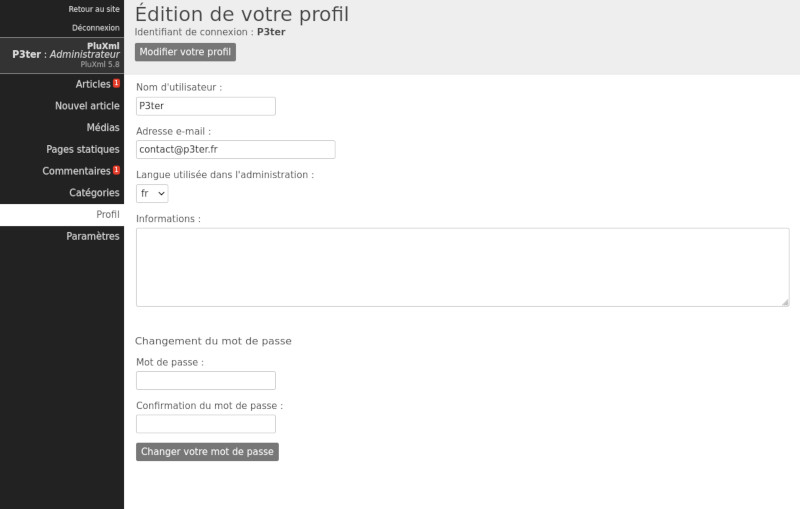

Éditer son profil
=================

Cliquez sur le lien Profil dans le menu principal de l’administration pour ouvrir cette page. Elle vous permet d’éditer votre profil personnel et de compléter celui-ci au besoin.

Changer ses informations personnelles
-------------------------------------

Vous pouvez éditer :

* Votre nom d’utilisateur : celui qui apparaît en ligne quand vous rédigez des articles ou quand vous réagissez à des commentaires. Attention : ce n’est pas votre identifiant de connexion qui ne peut être changé que par un Administrateur.
* Votre adresse e-mail : Vous pouvez renseigner votre adresse e-mail ou la modifier.
* La langue de l’interface administration : Vous pouvez changer la langue de votre interface d’administration (sans modifier la langue du site en ligne).
* Vos informations : Cette partie est libre, vous pouvez rajouter toutes les informations que vous souhaitez. C’est en quelque sorte un espace « signature » qui permet de vous exprimer. Le contenu de cette zone pourra être affiché en signature des articles sur votre site, si le thème du site utilisé le permet.

Modifier son mot de passe
-------------------------

Vous pouvez modifier votre mot de passe de connexion à l’interface d’administration. En cas de problème, vous devez contacter l’administrateur du site.

La couleur du champ indique le niveau de sécurité du mot de passe.

* Rouge : Niveau de sécurité faible
* Jaune : Niveau de sécurité moyen
* Vert : Niveau de sécurité fort