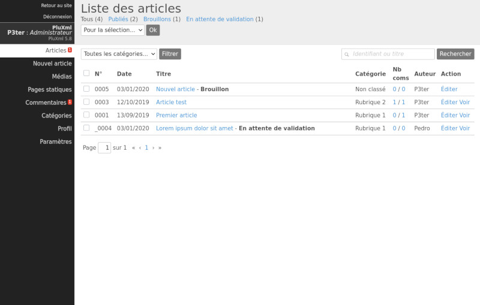
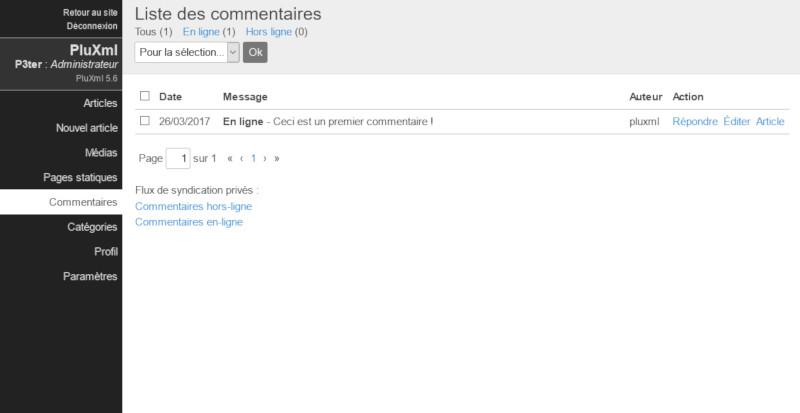
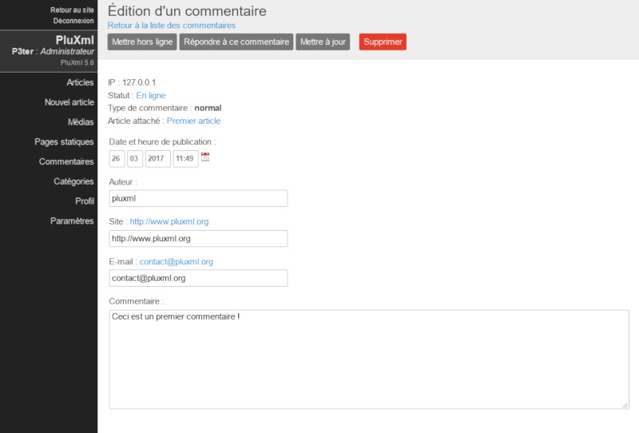
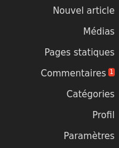
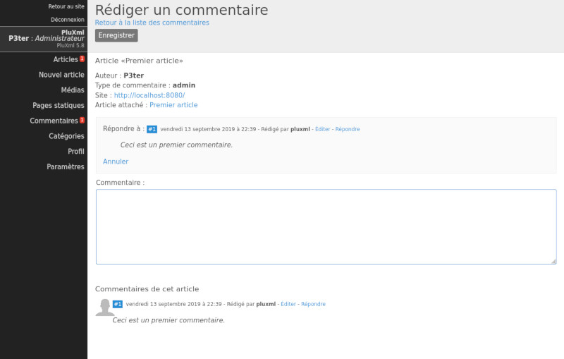
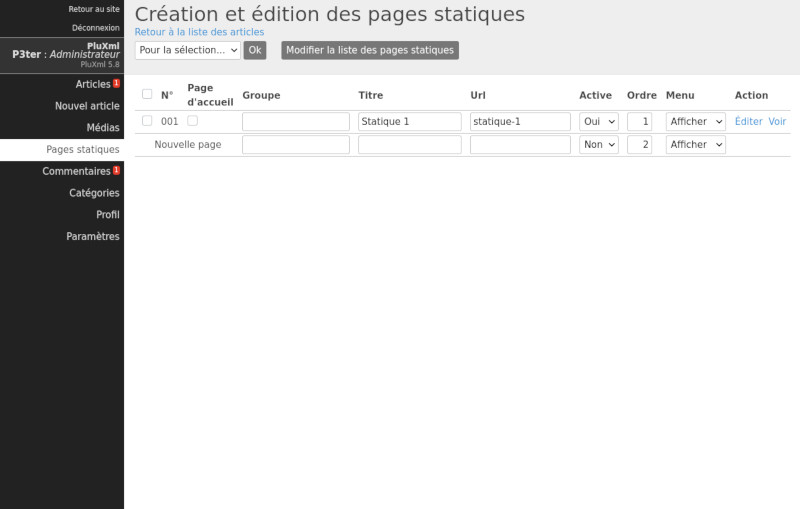
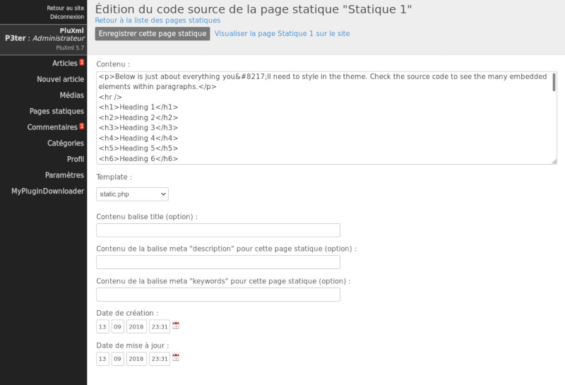
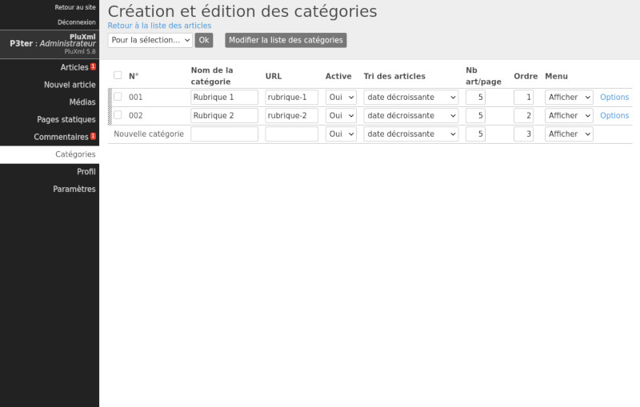
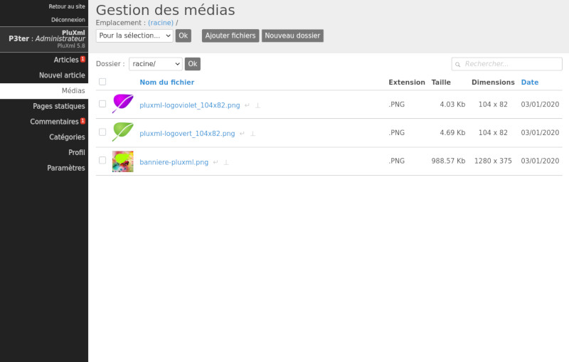

# Les articles

## Liste des articles
La page Articles liste tous vos articles, qu’ils soient en cours de rédaction, publiés, brouillons, ou en attente de validation.

### Articles publiés

Vos articles en ligne et publiés. Vous pouvez les modifier, les classer et les retravailler si besoin.

### Brouillons
Vos articles en cours de rédaction. Ces articles ne sont pas encore en ligne et sont des brouillons. Ce statut passera à Publié après la mise en ligne de l’article. À tout moment il est possible de le repasser hors ligne en rouvrant cet article et en cliquant sur Mettre hors ligne. Le statut repassera alors à Brouillon.

### Articles en attente de validation
Ce sont les articles en attente de validation. Ils sont prêts pour être publiés mais nécessitent l’intervention d’un autre utilisateur pour une relecture. La modération des articles par des profils *Rédacteur* et *Éditeur* s’active dans les paramètres de PluXml.

!!! note
    Voir la section : Paramétrage de PluXml

    Voir la section : les Comptes utilisateurs

### Filtrer la liste des articles
Vous pouvez filtrer les articles apparaissant dans la liste en fonction des rubriques pour faciliter ainsi la recherche et la gestion de vos articles.

### Supprimer un article
Pour supprimer un article, sélectionnez-le (ou les articles que vous souhaitez supprimer), en cochant les cases à cocher correspondantes. Dans la liste déroulante Pour la sélection, sélectionnez *Supprimer* et cliquez sur le bouton Ok.

### Rechercher dans les articles
Vous disposez d’un moteur de recherche pour retrouver facilement un article. Saisissez dans la zone de recherche le numéro de l’article (identifiant) ou le mot à rechercher dans le titre, puis cliquez sur le bouton Rechercher.

### Gérer un article
Une fois connecté au panneau d’administration, l’ensemble des articles rédigés ou en cours de rédaction, sont listés dans la section Articles. Lors de la première installation, un premier article est créé pour permettre de se familiariser avec les outils d’édition. Cet article peut être modifié en cliquant sur son titre : *Premier article*.

Pour rédiger un nouvel article, cliquez sur le lien *Nouvel article* dans la barre des menus dans le panneau d’administration. La page d’édition d'un article est composée de deux parties principales : la partie centrale qui contient les formulaires pour rédiger le contenu de l'article et une partie à droite qui liste les options.

#### Barre d’action
__Bouton Aperçu__

Le bouton Aperçu permet de visualiser l'article en cours de rédaction coté visiteur du site, sans que l'article ne soit publié. Il permet de contrôler les modifications d'un article avant de le mettre en ligne.

!!! note
    Voir la section : Les Comptes utilisateurs

__Bouton Enregistrer__

Le bouton *Enregistrer* permet d’enregistrer les modifications effectuées sur l’article en cours de rédaction ou de modification.

__Bouton Mettre hors ligne et Enregistrer comme brouillon__

Lorsqu’un article est publié, il est possible de ne plus l’afficher dans la partie publique du site sans pour autant le supprimer dans le cas par exemple où l’on veut faire une mise à jour. En cliquant sur le bouton Mettre hors ligne, l’article est toujours disponible dans la partie administration mais son état passe de publié à brouillon. Le bouton Mettre hors ligne est changé en Enregistrer brouillon. Lors de la rédaction d’un nouvel article, il n’y a pas de bouton Mettre hors ligne mais directement le bouton *Enregistrer* brouillon.

__Bouton Publier un article__
Pour un nouvel article ou pour les articles à l’état de brouillon, il est possible de les publier, c’est-à-dire de les rendre visibles dans la partie publique du site. Cette publication se fait simplement en cliquant sur le bouton *Publier*. Lorsqu’un article est publié, ce bouton n’est plus disponible. Il est remplacé par le bouton *Enregistrer* qui permet de publier toute modification immédiatement, sans avoir besoin de mettre l'article en brouillon.

__Bouton Supprimer__

Le bouton *Supprimer* permet de supprimer l’article. Une fenêtre de validation demandera de confirmer l’action. Si l’action est confirmée, elle est irréversible : l’article ne pourra pas être récupéré.

#### La partie centrale : rédaction ou modification d'un article

__Le titre__

Le premier champ de saisie concerne le titre de l’article. Notez que si le titre est omis lors de l’enregistrement, PluXml en génèrera un dont l’intitulé sera *Nouvel article*. Ce titre pourra être modifié par la suite, de même que l’URL construite automatiquement par le système (voir le paragraphe Options).

__Le corps de l’article__

Votre article se décompose en deux parties.

* Le chapô (facultatif) : correspond à l’accroche de votre article. Cliquez sur le lien *Afficher* pour visualiser le champ qui vous permettra d’écrire les premières lignes de votre article. Ces dernières apparaîtront sur la page d’accueil de votre site suivies d'un lien *Lire la suite...*
* Le contenu : le corps de l’article.

Si le chapô n’est pas renseigné, le contenu de l’article sera affiché en entier sur la page d’accueil. Cliquez sur le lien *Afficher* pour faire apparaitre la zone de saisie du chapô. Le texte du chapô et du contenu est au format html, c’est-à-dire que si vous souhaitez le mettre en forme, vous pourrez utiliser les balises du langage html. Si vous n'êtes pas familier avec le langage html, il existe plusieurs plugins qui vous permettront d'enrichir ces formulaires avec un éditeur WYSIWYG.

!!! note
    Voir la section : Les Plugins

__Lien de l’article__

En bas de l’éditeur, se trouve l’URL finale que l’article possédera quand il sera en ligne. Au niveau de la section Lien de l’article, le lien Voir permet à tout moment d’afficher l’article dans le navigateur.

__Image d’accroche__

Cette option facultative vous permet d’ajouter une image d’illustration à l’article. En cliquant sur l’icône « + », vous pourrez sélectionner une image dans le Gestionnaire de médias. Le titre de l’image (facultatif) sera visible au survol de l’image avec la souris. Le texte alternatif de l’image (facultatif) est le texte affiché à la place de l’image si celle-ci n’existe pas ou plus sur le serveur.

#### La partie de droite : les options d’un article

__État__

Lors de la rédaction d'un nouvel article, le statut affiché de l'article est Brouillon. Il passera à l’état Publié dès qu’il aura été mis en ligne.

__Auteur__

Par défaut, c’est le nom de l’utilisateur en cours qui apparaît mais il est possible de le modifier s’il y a plusieurs membres et si les droits de l'utilisateur connecté à la zone d'administration le permettent. Pour changer l'auteur de l'article, sélectionnez-le dans la liste déroulante *Auteur*

!!! note
    Voir la section : Les Comptes utilisateurs

__Date de publication__

Par défaut, lors de la rédaction d’un nouvel article, la date de publication correspond à la date de rédaction de l'article. Il est possible de choisir la date et l’heure de publication de l’article en renseignant ces champs ou en cliquant sur l’icône calendrier pour choisir automatiquement la date courante.

Par défaut, les articles apparaîtront sur le site par ordre chronologique croissant ou décroissant.
!!! note
    Voir la section : Paramétrage de PluXml

Il est possible de mettre une date future afin de planifier la date de publication de l'article. Tant que la date n'est pas atteinte, l'article n'est pas visible sur la partie publique du site.

__Date de création__

La date de création est renseignée par défaut. Elle peut être modifiée.

__Date de modification__

La date de création est renseignée par défaut. Elle peut être modifiée. Elle est actualisée à chaque enregistrement de l’article après une création ou une modification

__Emplacements (catégories)__

Ce sont les catégories dans lesquelles l'article peut être classé. Il en existe plusieurs en natif : *Non classé*, *Page d'accueil* et *Rubrique 1*. Elles peuvent être modifiées et d’autres ajoutées.

Un article peut être associé à aucune catégorie, à une ou à plusieurs. Il suffit de cocher les cases souhaitées.

__Nouvelle catégorie__

Ce champ permet de créer une nouvelle catégorie sans passer par l'écran de gestion des catégories.
!!! note
    Voir la section : Les Catégories

__Mots clés__

Séparez les mots clés avec des virgules. Avec le thème par défaut les mots clés (ou tags) apparaîtront sous vos articles et dans le nuage de mot clés. Ils attireront l’attention de vos lecteurs et les redirigeront vers toutes les pages comportant les tags en question. Ces tags ne sont pas utilisés par les moteurs de recherches mais uniquement par votre site.

__Autoriser les commentaires__

Vous pouvez autoriser le système de commentaires pour l'article. Pour qu'il soit effectif, il faut que la publication des commentaires soit autorisée dans les paramètres généraux du site.

!!! note
    Voir la section : Paramétrage de PluXml

    Voir la section : Les Commentaires

__Url__

C'est l'URL par laquelle l'article est accessible. Par défaut, Pluxml remplira ce champ automatiquement à partir du titre de l'article. Cette URL peut être modifiée. Elle doit être unique.

__Template__

L'affichage du contenu de tous les articles coté visiteur se base sur le fichier article.php disponible dans le dossier du thème utilisé. Il est possible de personnaliser l'affichage de chaque article en utilisant un fichier template. Sélectionnez le fichier template à utiliser dans la liste déroulante template.

!!! note
    Voir la section : Les Templates

__Contenu balise title (option)__

Ce champ permet de définir le contenu de la balise *\<title\>* de la page html de l'article. Par défaut la balise *\<title\>* est renseignée à partir du titre de l'article.

__Contenu balise meta "description" (option)__

Ce champ permet de définir le contenu de la balise <description> de la page html de l'article. Il permet de définir la description de votre article. Cette information est utilisée par les moteurs de recherche.

__Contenu balise meta "keywords" (option)__

Ce champ permet de définir le contenu de la balise <keywords> de la page html de l'article. Séparez les mots clés par des virgules. Ils sont utilisés par les moteurs de recherche pour référencer les articles.

__Options supplémentaires__
Il s’agit de deux liens pour gérer les commentaires ou rédiger un commentaire, relatifs à l’article en cours de rédaction.
!!! note
    Voir la section : Les Commentaires

En dessous du lien *Gérer les commentaires* sont affichés les nombres de commentaires en ligne et hors ligne rattaché à l’article.

## Les commentaires
Les commentaires peuvent être modifiés, supprimés ou mis hors ligne, depuis l’interface d’administration de PluXml via le menu Commentaire. L’administrateur peut agir sur les commentaires via deux écrans : *Liste des commentaires* et *Edition d’un commentaire*.

### Autoriser ou interdire les commentaires
Par défaut, les commentaires postés par les internautes sont publiés automatiquement. Toutefois, l’administrateur du site peut interdire leur publication soit globalement sur l’ensemble du site, soit unitairement par article. À noter la présence d’une option pour modérer un commentaire à sa création.

__Pour tous les articles__

Pour interdire les commentaires, il faut se rendre sur l’interface d’administration de PluXml, puis dans *Paramètres > Configuration de base* :

Sélectionnez *Non* à la ligne *Autoriser les commentaires*. Cliquez sur le bouton *Modifier* la configuration de base pour enregistrer le nouveau réglage.

L’interdiction globale supprime la possibilité de créer un commentaire pour tous les articles du site. Cependant, cette option n’efface pas ceux préalablement publiés.

Pour les autoriser, reprendre la même procédure en sélectionnant *Oui* à la ligne *Autoriser* les
commentaires.

__Pour un article spécifique__

L’autorisation ou l’interdiction de commentaires peuvent être gérées article par article. Pour interdire les commentaires sur un article spécifique, se rendre sur l’interface d’administration de PluXml, puis cliquer sur le menu *Articles*. Éditez l’article (lien Éditer). Sélectionnez *Non* pour le paramètre Autoriser les commentaires. Cliquez sur le bouton *Enregistrer*, *Publier* ou *Enregistrer le brouillon* selon l’état de l’article afin d'enregistrer le nouveau réglage.

Le paramètre *Autoriser les commentaires* n’apparaît pas si les commentaires sont globalement interdits.

Pour autoriser les commentaires sur un article, reprendre la même procédure en sélectionnant *Oui* pour le paramètre Autoriser les commentaires.

__Modérer les commentaires à leur création__

PluXml offre la possibilité de modérer les commentaires à leur création. Cela signifie que chaque commentaire doit être validé par l’administrateur du site pour être publié. Pour activer la modération des commentaires à leur création, il faut se rendre sur l'interface
d'administration de PluXml, menu *Paramètres*, sous-menu *Configuration de base*.

Sélectionnez *Oui* à la ligne *Modérer les commentaires à la création*. Cliquer sur le bouton Modifier la configuration de base afin d'enregistrer le nouveau réglage.

Lorsque la modération des commentaires à leurs créations est activée, chaque commentaire créé, est consultable dans le menu Commentaires de l’interface d’administration de PluXml. Pour le mettre en ligne, lire la section *Commentaires en ligne* ci-dessous.

### Liste des commentaires

Cet écran présente les commentaires sous forme d’un tableau à 4 colonnes :

* Date : date de création du commentaire.
* Message : texte du commentaire accompagné de son statut (en ligne ou hors ligne).
* Auteur : auteur du commentaire.
* Action : actions d'administration disponibles pour ce commentaire
  - Répondre : renvoie vers l'écran de réponse au commentaire.
  - Éditer : modifier le commentaire.
  - Article : renvoie vers l'écran de modification de l’article attaché au commentaire.

Une liste de choix déroulante Pour la sélection... est accessible en haut de l’interface. L’action choisie dans cette liste sera appliquée à chaque message coché, après un clic sur le bouton Ok. Les actions disponibles sont :

* Mettre en ligne
* Mettre hors ligne
* Supprimer

Deux liens en bas de page permettent de s’abonner aux flux RSS des commentaires hors ligne et en-ligne. Ces deux flux sont privés, ils permettent à l’administrateur de suivre la publication de commentaires sur son site et d’entrer directement dans le menu l’administration de PluXml pour arriver sur l’écran *Édition d’un commentaire*.

### Édition d’un commentaire

Éditez le commentaire en cliquant sur le lien Éditer, situé à droite du commentaire dans la colonne *Action*. La page *Édition d’un commentaire* s’affiche.

Plusieurs actions sont mises à disposition de l’administrateur via une série de boutons placés en bas de page. Les actions disponibles dépendent du statut du commentaire édité. Actions disponibles pour un commentaire en ligne :

* Suppression
* Mise hors ligne
* Réponse au commentaire
* Mise à jour

Actions disponibles pour un commentaire hors ligne

* Suppression
* Mise en ligne
* Mise à jour

__Commentaires en ligne__

Par défaut, un commentaire créé est au statut *En ligne* (si l’option Modérer les commentaires à la création n’est pas activée). Par conséquent, il sera affiché sur le site en partie publique après l'article concerné.

Pour mettre en ligne un commentaire, il faut agir via l’interface d’administration des commentaires sur l’action Mettre en ligne de l’écran Liste des commentaires ou sur le bouton Valider la publication de l’écran Édition d’un commentaire.

__Commentaires hors ligne__

L’interface d'administration de PluXml permet d’identifier rapidement le nombre de commentaires hors ligne. Le nombre de commentaire
hors ligne est affiché en blanc sur fond rouge à droite du menu *Commentaires*.

Un commentaire est hors ligne s’il a été modéré par l’administrateur ou si la publication dès la création a été désactivée par l’administrateur (option Modérer les commentaires à la création activée).

Pour mettre hors ligne un commentaire, il faut agir via l’interface d’administration des commentaires sur l’action Mettre hors en ligne
de l’écran Liste des commentaires ou sur le bouton Mettre hors ligne de l’écran Édition d’un commentaire.

__Modifier un commentaires__

Tout commentaire peut être modifié, qu’il soit en ligne ou hors ligne, via l’écran Edition d’un commentaire. Ce dernier permet la modification des champs Date et heure de publication, Auteur, Site, E-mail et Commentaire (le contenu du message).

Pour un commentaire en ligne, toute modification apportée à l’un de ces champs sera publiée en cliquant sur le bouton Mettre à jour. Le texte est au format html, c’est-à-dire que si vous souhaitez le mettre en forme, vous pourrez utiliser les balises du langage html. Si vous n'êtes pas familier avec le langage html, il existe plusieurs plugins qui vous permettront d'enrichir ces formulaires avec un éditeur WYSIWYG.

!!! note
    Voir la section : Plugins

Pour un commentaire hors ligne, la modification apportée sera enregistrée en cliquant sur le bouton *Mettre à jour*. Vous pouvez enregistrer et publier le commentaire en même temps en cliquant sur le bouton Valider la publication.

### Répondre à un commentaire
L’administrateur peut répondre à un commentaire en cliquant sur le lien Répondre, depuis l’écran Liste des commentaires ou en cliquant sur Répondre à ce commentaire depuis l’écran *Édition d’un commentaire*.

Cette page est divisée en deux parties :

* Rédiger un commentaire : l e champ Informations permet de répondre. Le code HTML déjà présent affiche la date et le nom de l’auteur du commentaire à qui on répond.
* Commentaires de cet article : affichage ante-chronologique des commentaires attachés à l’article.

Pour répondre, saisir du texte dans le champ Informations puis cliquez sur le bouton Enregistrer. La réponse est alors immédiatement publiée. Le texte est au format html, c’est-à-dire que si vous souhaitez le mettre en forme, vous pourrez utiliser les balises du langage html. Si vous n’êtes pas familier avec le langage HTML, il existe plusieurs plugins qui vous permettront d’enrichir ces formulaires avec un éditeur WYSIWYG.

!!!note
    Voir la section : Plugins

### Supprimer un commentaire
Tout commentaire peut être supprimé, qu’il soit en ligne ou hors ligne, via les deux écrans d’administration des commentaires (Liste des commentaires et Édition d’un commentaire).

Liste des commentaires :

* Cocher le commentaire à supprimer.
* Sélectionner l’action *Supprimer* dans la liste déroulante *Pour la sélection...*
* Cliquer sur le bouton *Ok*

Le commentaire est immédiatement supprimé, sans demande de confirmation.

Édition d’un commentaire :

* Cliquer sur le bouton *Supprimer*.
* Une fenêtre demande la confirmation de suppression
* Cliquer sur *Ok* pour supprimer définitivement le commentaire.

### Flux RSS des commentaires
Accessibles depuis l’administration à l’écran Liste des commentaires, ces flux RSS, permettent aux utilisateurs du site, de suivre la publication de nouveaux commentaires.

Les utilisateurs ayant les droits suffisants peuvent accéder directement depuis ces flux, aux écrans de modérations des commentaires, grâce à un lien présent dans le flux RSS.

## Pages statiques

### Créer une nouvelle page statique
Pour créer une page statique, cliquez sur le menu Pages statiques. Par la suite, cette page recensera l’ensemble des pages statiques que vous aurez rédigées. En face de Nouvelle page, renseignez le titre de la page que vous souhaitez créer, puis cliquez sur Modifier la liste des pages statiques (à ce stade, il n’est pas encore nécessaire de remplir les autres champs).

Lorsque cela sera fait, votre page s’ajoutera dans le tableau listant vos pages, mais celle-ci n’est pas encore active. Pour éditer le contenu de cette page, cliquez sur le lien Éditer dans la colonne Action situé sur la ligne de la page que vous avez créée précédemment.

À ce stade, vous pouvez commencer à rédiger le contenu de votre page. Lorsque cela sera fait, cliquez sur le bouton Enregistrez cette page statique. Votre page est maintenant créée, mais elle n’est pas encore en ligne.

### Propriétés des pages statiques

__Page d’accueil__

PluXml vous offre la possibilité de placer une page spécifique en page d’accueil. Pour cela, cliquez sur le menu Page statiques, et dans la colonne Page d’accueil, cochez la ligne correspondant à la page que vous souhaitez placer en page d’accueil. Pour valider votre changement, cliquez sur le bouton *Modifier la liste des pages statiques*.

__Groupe de pages statiques__

Si certaines de vos pages statiques font partie d’une même thématique, vous avez la possibilité de les organiser en groupes. Pour cela, cliquez sur le menu Pages statiques et dans la colonne Groupe saisissez le nom du groupe souhaité pour chacune de vos pages. Pour valider vos changements, cliquez sur le bouton Modifier la liste des pages statiques.

__Changer l’URL d’une page statique__

Lorsque vous créez une page statique, PluXml génère automatiquement une URL basée sur le titre que vous avez choisi. Pour modifier l’URL d’une page statique, cliquez sur le menu Pages statiques, et dans la colonne URL, modifiez l’adresse URL sur la ligne correspondant à la page que vous souhaitez modifier.

Il faudra respecter le formalisme imposé par le protocole HTTP, afin d’être sûr que cette adresse soit prise en compte dans tous les cas. Elle ne devra contenir ni accent, ni caractères spéciaux (&, €, !, ...), ni espace. Dans le doute, il est préférable de laisser PluXml la générer automatiquement.

__Activer ou désactiver une page statiques__

Pour activer ou désactiver une page statique (mettre en ligne ou hors ligne une de vos pages), cliquez sur le menu Pages statiques, et repérez la colonne nommée Active. Sur la ligne correspondant à la page que vous souhaitez, choisissez Oui ou Non à l’aide du menu déroulant pour sélectionner la mise en ligne ou hors ligne de votre page. Pour valider votre changement, cliquez sur le bouton Modifier la liste des pages statiques.

__Tri des pages statiques__

PluXml classe vos pages par numéro. Modifiez l’ordre de vos pages en cliquant sur le menu *Pages statiques*, puis repérez la colonne nommée *Ordre*. Saisissez un chiffre sur la ligne correspondant à la page que vous souhaitez modifier, puis cliquez sur Modifier la liste des pages statiques pour valider vos changements.

Vous pouvez également changer l'ordre des pages statiques par *drag and drop*. Cliquez et maintenez le clic sur la page statique à déplacer, puis glissez celle-ci vers le haut ou le bas en fonction de la position que vous souhaitez lui donner.

__Masquer une page statique dans la barre des menus__

Par défaut, PluXml affiche l’ensemble de vos pages sur le menu de navigation de votre site. Vous avez la possibilité d’exclure des pages de ce menu sans pour autant les mettre hors ligne. Pour cela, cliquez sur le menu Pages statiques, et dans la colonne nommée Menu, sélectionnez Afficher ou Masquer sur la ligne correspondant à la page que vous souhaitez modifier. Pour valider votre
changement, cliquez sur le bouton Modifier la liste des pages statiques.

### Rédiger le contenu d’une page statique

Pour rédiger une page statique, cliquez sur le menu Page statiques, repérez la colonne nommée Action, et sur la ligne correspondant à la page que vous souhaitez remplir, cliquez sur le lien Éditer. Saisissez le contenu de votre page, puis cliquez sur le bouton Enregistrer cette page statique pour valider vos changements.

### Options des pages statiques

__Template__

Vous avez la possibilité de choisir une mise en page pour votre page statique (en fonction du thème). Pour choisir votre template, éditez votre page, puis en bas, sélectionnez une mise en page à l’aide du menu déroulant dans la partie nommé Template. Pour finir, cliquez sur le bouton Enregistrer cette page statique pour valider vos changements.

!!! note
    Voir la section : Les Templates

Si vous n’êtes pas familier avec le langage HTML, il existe plusieurs plugins qui vous permettront d’enrichir ces formulaires avec un éditeur WYSIWYG.

__Balises title et meta__

PluXml vous offre la possibilité de choisir vos balises title et méta pour chacune de vos pages. Si vous choisissez de ne pas personnaliser ces balises, PluXml utilisera celle que vous avez choisie dans les paramètres généraux du site.

!!! note
    Voir la section : Paramétrage de PluXml

Pour éditer vos balises title et méta pour chacune de vos pages, éditez la page voulue, puis saisissez les champs nommés Contenu balise title (option), Contenu de la balise meta « description » pour cette page statique (option) et Contenu de la balise meta « keywords » pour cette page statique (option). Pour finir, cliquez sur le bouton Enregistrer cette page statique pour valider vos
changements.

Notez que ces champs sont importants pour le référencement de votre page sur les moteurs de recherche.

__Date de création et de modification__

Les dates de création et de modification de la page sont renseignées automatiquement par PluXml, mais elles peuvent être changées manuellement si besoin.

### Supprimer une page statique
Pour supprimer une page statique, cliquez sur le menu Pages statiques, repérez la colonne nommée Identifiant, et cochez la case sur la ligne ou les lignes des pages correspondantes à celles que vous souhaitez supprimer. Pour valider la suppression, cliquez sur le bouton Modifier la liste des pages statiques.

## Les Catégories

### Créer une nouvelle catégorie

Pour créer une catégorie relative à un ou plusieurs articles, vous pouvez utiliser le gestionnaire de catégories. Pour commencer, cliquez sur le menu Catégories et en face de Nouvelle catégorie, saisissez le nom de votre catégorie (les autres champs ne sont pas nécessaires à ce stade). Pour finir, cliquez sur le bouton Modifier la liste des catégories pour valider votre changement.

### Propriétés d’une catégorie

__Changer l’URL d’une catégorie__

Vous avez la possibilité de modifier l’adresse URL de chaque catégorie : pour cela, cliquez sur le menu Catégories, repérez la ligne correspondant à la catégorie que vous souhaitez modifier, puis dans la colonne nommée Url, saisissez son adresse URL.

Si vous souhaitez malgré tout la modifier, il faudra respecter le formalisme imposé par le protocole HTTP, afin d’être sûr que cette adresse soit prise en compte dans tous les cas. Elle ne devra contenir ni accent, ni caractères spéciaux (&, €, !, ...), ni espace. Dans le doute, il est préférable de laisser PluXml la générer automatiquement.

__Activer ou désactiver une catégorie__

Pour activer ou désactiver une catégorie, cliquez sur le menu Catégories, repérez la ligne correspondant à la catégorie que vous souhaitez modifier, et dans la colonne nommée Active, utiliser le menu déroulant pour choisir votre statut (Oui ou Non). Pour finir, cliquez sur le bouton Modifier la liste des catégories pour valider la modification.

__Tri des articles classés dans une catégorie__

Vous disposez de quatre modes de tri pour trier les articles dans les catégories : date décroissante, date croissante, par ordre alphabétique (en fonction du titre) ou par ordre alphabétique inversé. Pour modifier ce paramètre, cliquez sur le menu Catégorie, repérez la ligne correspondant à la catégorie que vous souhaitez modifier, et dans la colonne nommée Tri des articles, sélectionnez-le menu déroulant pour faire votre choix. Pour finir, cliquez sur le bouton Modifier la liste des catégories pour valider votre changement.

__Nombre d’articles par page__

Pour définir les nombre d'articles affichés par page, cliquez sur le menu Catégorie, repérez la ligne correspondant à la catégorie que vous souhaitez modifier, et, dans la colonne nommée Nb art/page, insérez une valeur numérique de votre choix (par exemple 5). Pour finir, cliquez sur le bouton Modifier la liste des catégories pour valider votre changement.

__Tri des catégories__

Les catégories peuvent être classées dans l’ordre que vous souhaitez. Pour cela, cliquez sur le menu Catégories, repérez la ligne correspondant à la catégorie que vous souhaitez modifier, et, dans la colonne nommée *Ordre*, saisissez un chiffre (le chiffre 1 indique que cette catégorie sera en première position et ainsi de suite). Pour finir, cliquez sur le bouton Modifier la liste des catégories pour valider votre changement.

Vous pouvez également changer l'ordre des catégories par *drag and drop*. Cliquez et maintenez le clic sur la catégorie à déplacer, puis glissez celle-ci vers le haut ou le bas en fonction de la position que vous souhaitez lui donner.

__Masquer une catégorie dans la barre des menus__

PluXml dispose d’un menu de navigation où vous pouvez afficher la liste des catégories. Pour cela, cliquez sur le menu Catégories, repérez la ligne correspondant à la catégorie que vous souhaitez modifier, et, dans la colonne nommée Menu, utilisez-le menu déroulant pour faire votre choix (Afficher ou Masquer). Pour finir, cliquez sur le bouton Modifier la liste des catégories pour valider votre changement.

### Options des catégories

__Afficher les articles d’une catégorie sur la page d’accueil__

PluXml vous offre la possibilité de placer les articles d’une catégorie en page d’accueil. Pour cela, cliquez sur le menu Catégories, repérez la ligne correspondant à la catégorie que vous souhaitez modifier, puis cliquez sur le lien Options. Dans le menu déroulant Afficher les articles de cette catégorie sur la page d’accueil, choisissez la valeur Oui ou Non.

Pour valider vos changements, cliquez sur le bouton Mettre à jour cette catégorie.

__Description__

Pour ajouter une description à chacune des catégories, cliquez sur le menu Catégorie, repérez la ligne correspondant à la catégorie que vous souhaitez modifier, puis cliquez sur le lien Options. Saisissez une description pour la catégorie dans la zone Description. Pour valider vos changements, cliquez sur le bouton Mettre à jour cette catégorie.

__Template__

Pour attribuer un template à une catégorie, cliquez sur le menu Catégorie, repérez la ligne correspondant à la catégorie que vous souhaitez modifier, puis cliquez sur le lien Options. Dans le menu déroulant Template, sélectionnez la mise en page de votre choix. Pour valider vos changements, cliquez sur le bouton Mettre à jour cette catégorie.

!!! note
    Voir la section : Les Templates

__Balises title et meta__

Pour paramétrer les balises title et méta de chacune des catégories, cliquez sur le menu Catégorie, repérez la ligne correspondant à la catégorie que vous souhaitez modifier, puis cliquez sur le lien Options.

Saisissez dans les champs suivant les valeurs souhaitées :

* Contenu balise title (option)
* Contenu de la balise meta « description » pour cette catégorie (option)
* Contenu de la balise meta « description » pour cette catégorie (option)

Si vous laissez ces champs vides, PluXml utilisera le contenu de vos balises définies par défaut dans les paramètres de base du site.
Pour valider vos changements, cliquez sur le bouton Mettre à jour cette catégorie. Ces champs sont importants pour le référencement sur les moteurs de recherches.

## Gestionnaire de médias
Le gestionnaire de médias permet de gérer les images et les documents stockés sur votre site. Cet écran est accessible en cliquant sur le lien Médias du menu principal de la zone d'administration.

### Ajouter des fichiers
Le bouton Ajouter Fichiers vous permet d'envoyer des fichiers sur votre site. La taille maximale des images dépend de la configuration du serveur. Les formats d’images que vous pouvez utiliser avec PluXml sont : gif, jpg, jpeg, bmp et png.

### Copier vers le presse papier
Le bouton « Copier le lien dans le presse papier » vous permet de copier l’URL du fichier vous permettant d’y accéder directement.

### Renommer un fichier
Le bouton « Renommer » vous permet de renommer un fichier.

### Redimensionner les images
PluXml peut redimensionner vos images automatiquement. Il suffit de choisir une taille par défaut dans la liste ou bien de spécifier un format personnalisé. Le redimensionnement ne rogne pas sur les images, les proportions sont conservées.

### Créer des miniatures
PluXml peut créer automatiquement une miniature des images envoyées. La création de miniatures respecte les proportions de l’image d’origine.

### Documents
La liste des fichiers autorisés pouvant être envoyés sur le site est :

7z|aiff|asf|avi|csv|doc|docx|epub|fla|flv|gz|gzip|m4a|m4v|mid|mov|mp3|mp4|mpc|mpeg|mp
g|ods|odt|odp|ogg|pdf|ppt|pptx|pxd|qt|ram|rar|rm|rmi|rmvb|rtf|swf|sxc|sxw|tar|tgz|txt|vtt|
wav|webm|wma|wmv|xcf|xls|xlsx|zip.

### Créer un dossier
Pour créer un dossier dans l'emplacement en cours de visualisation, saisissez le nom d'un dossier dans le champ Nouveau dossier et cliquez le bouton Créer.

### Changer de dossier
Pour visualiser le contenu d'un dossier ou changer d'emplacement, sélectionnez dans la liste déroulante Dossier le nom du dossier et cliquez sur le bouton Ok

### Trier l’affichage des fichiers
Le tableau affichant le contenu de votre répertoire, et réparti ainsi :

* Nom du fichier : le nom de votre fichier
* Extension : le format du fichier (.jpg, .zip, etc)
* Taille : la taille kilo-octet du fichier
* Dimensions : la résolution de l'image (par exemple, 800x600)
* Date : la date d’ajout du fichier sur le serveur

Cliquez sur l’un des titres de colonnes, pour changer le tri des fichiers.

### Déplacer des fichiers
Sélectionnez un fichier en cochant la case correspondante. Sélectionnez le dossier de destination dans la liste déroulante Dossier. Dans la liste déroulante Pour la sélection sélectionnez la valeur Déplacer. Cliquez sur Ok pour effectuer le déplacement de l’image.

### Supprimer des fichiers
Sélectionnez un fichier en cochant la case correspondante. Dans la liste déroulante Pour la sélection, sélectionnez la valeur Supprimer. Cliquez sur Ok pour effectuer la suppression de l’image.

### Recréer les miniatures
Si vous souhaitez créer ou recréer une ou plusieurs miniatures des images, sélectionnez les images en cochant la case correspondante des images, dans le déroulant Pour la sélection sélectionnez *Recréer des miniatures*. Cliquez sur *Ok* pour démarrer la création des miniatures.

Les miniatures créées ont les dimensions paramétrées dans l’administration de PluXml à partir de l’écran Options d’affichage. Par défaut ces dimensions sont de 200 pixels en largeur et de 100 pixels de hauteur.
