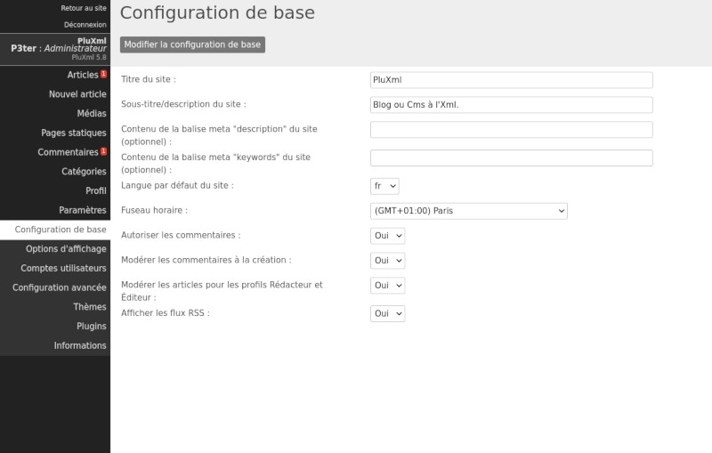

# PluXml customization and configuration
One of the first thing to do after your first administration panel access is to set the basics parameters.
On the left menu, click on "Parameters", a sub-menu will be displayed

## Basic configuration

__Site title__

This field is optional and allows you to edit your website title.

__Subtitle / Site description__

This field is optional and allows you to edit the subtitle or your website short description.

__Content of "description" meta tag (optional)__

A description for the website to be used by search engines (SEO).

__Content of "keywords" meta tag (optional)__

A keywords list separated by commas for search engines. These keywords are used globaly for your website. There are not relative to a specific page or article.

__Default site language__

The default language used in the administation panel and on your website site public view.

__Time Zone__

The time zone used to display correct dates and times for your country.

__Allow comments__

* No : comments are disabled for the whole website. The comment form will not be displayed.
* Yes : comments are allowed for all articles.

__Moderate comments when created__

* No : All new comments are automaticaly published.
* Yes : Before being published, comments les commentaires doivent être validésmust be validated by a user with sufficient rights.

!!! note
    See : User accounts

__Moderate articles for Editor and Publisher profiles__

This feature allow the Administrator to publish or not articles written by Editor or Writer users.

!!! note
    See : User accounts

__Display RSS feeds__

Display or not the rss feed link on your website public view.

## Display settings
This is where you can configure the pages display on your website.

__Template of the homepage__
Allows you to define a specific template for your homepage (root of the public view).

!!! note
    See : Templates

__Sorting articles__

By default, the articles appear in chronological order, you can display them by ascending date, descending date or in alphabetical order.

__Articles per page__

Indicate the number of articles to display per page.

__Articles per page in tags__

Indicate the number of articles to display on a keyword page.

__Articles per page in archives__

Indicate the number of articles to display on an archive page.

__Articles per page in administration__

Indicate the number of articles to display per page in the administration panel.

__Sorting comments__

Sort comments by ascending or descending date.

__Comments per page in administraton__

Allows you to define the number of comments to display per page in the Comments section of the administration panel.

__Display categories without article__

By default, categories that do not contain articles are not displayed on the website public view. To display empty categories, select the value *Yes* in the drop-down list.

!!! note
    See : Categories

__Images and thumbnails size (width x height)__

When uploading an image to your site from the media manager, a thumbnail can be created. Among the proposed size values you can define a personal size here by defining a width and a height. This setting will be displayed in the media manager.

!!! note
    See : Media manager

__Create thumbnails__

If set to *Yes*, the system will automatically create thumbnails when sending images with the media manager.

!!! note
    See : Media manager

__N° of Articles or comments in the Rss feed__

Allows you to define the number of articles and comments in the RSS feeds offered by your website.

__Only display headlines in the Rss article feed__

Allows you to display only your articles headlines in the RSS feeds offered by your website.

!!! note
    See : Articles

__Signature used in the end of every Rss feed's article__

Here you can add a text, a signature, a link, which will be displayed at the end of each article in the RSS feeds offered by your site.

!!! danger "Important"
    Do not forget to validate after doing changes in this section by clicking on *Save display settings*.

## Advanced configuration

### Website operating

__Enable url rewriting__

URL rewriting is a process that results in nicer addresses and is great for search engines.

Instead of having : http://website.net/index.php?artice23/my-page

You will have : http://monsite.net/artice23/ma-page

You must first have URL rewriting enabled on your server or on your hosting. If this feature is not available on your web host, leave the setting to *No*.

__Enable GZIP compression__

When changed to *Yes* this setting will compress pages and save bandwidth, making the site faster. However, this increases the CPU load on the machine that hosts your website.

__Enable password recovery__

This setting allow the password recovery link to be displayed on the login screen.

__Enable anti spam-capcha__

Allows you to display a basic captcha to secure comments on your articles. It is important, to avoid spam, to set this setting to *Yes*.

__Use separate medias folders for every writer__

If you are the only one working in the administration of your site, you can leave this option to *No*. On the other hand, if you plan to be several to work on the website, it is advantageous to use this option so that each user has a reserved space to manage their medias.

__Administration key (private URLs)__

Leave by default or empty the field to regenerate the key. This key is used in the link of RSS feeds to protect administration access from online and offline comments.

__Configuration files (folder) location__

Location of configuration files: default data/configuration/.

__Articles (folder) location__

Location of folder storing articles files: default data/articles/

__Comments (folder) location__

Location of the folder storing comments files: default data/commentaires/

__Static page (folder) location__

Location of the folder storing static pages files: default /data/statiques/

__Medias (folder) location__

Location of the folder storing images or other user documents: by default /data/medias/

__Themes (folder) location__

Location of the folder storing themes: by default /themes/

__Plugins (folder) location__

Location of the folder storing plugins: by default /plugins/

__Location and name of custom css file of the administration area (optional)__

Location of the users css file to modify the appearance of the administration panel. Example: data/admin-theme.css

!!! danger "Important"
    Don't forget to put a / (slash) at the end of the folder paths.

To validate the settings in this section, click *Save advanced configuration* button.

### Email sending

This section allows you to configure the sending of emails by PluXml. Several methods are available:

* __sendmail__ : use of the local configuration of the host or the server (EXIM4, for example). No configuration needed in the administration of PluXml.
* __SMTP__ : use of an external server (OVH, Gandi, for example).
    * __SMTP hostname__ : SMTP server name (example: ssl0.ovh.net)
    * __SMTP username__ : user name on the SMTP host (example: pluxml@smtpserver.com)
    * __SMTP password__ : user password on SMTP host
    * __SMTP port__ : SMTP host port number (default: 465)
    * __SMTP encryption__ : encryption protocol to use (SSL, TLS or none)
* __SMTP OAUTH2__ : use of an external service (compatible only with GMAIL).
    * __Email address__ : the address used on the OAUTH2 service (example: pluxml@gmail.com)
    * __Client ID__ : customer identifier on the OAUTH2 service (example:664335625964-uha1vkt20qcvooug81ubjkkgfagktj5d.apps.googleusercontent.com)
    * __client secret key__ : the customer's key on the OAUTH2 service (example: PrsvKp6aprKdnN9seeCoC8-x)
    * __Token__ : authentication token on the OAUTH2 service

!!! note "Compatibility and generation of the OAUTH2 token"
    * PluXml is compatible with the OAUTH2 protocol, but allows tokens to be generated only for Google GMAIL service.
    * The client ID and the secret code, must be created from the service provider [Google Cloud Platform](https://cloud.google.com). The "Authorized redirect URL" field should contain the URL of your site followed by "/core/admin/get_oauth_token.php" (see screenshot below).
    * Once the client ID and the secret key have been entered in the PluXml administration panel, click on the "*Modify the advanced configuration*" button to save, then click on the "*Generate a token*" button at the bottom of the page.
    
    

## User accounts
PluXml is multi-user, which means you can host a community of members with different use and management rights across your site.

By clicking on *Parameters > User accounts*, you access the user management page, allowing you to add and modify users under 5 levels.

__Administrator__ : they have all rights to the entire site. The default administrator is the one who installs PluXml: his rights cannot be changed.

__Manager__ : they have almost the same rights as the administrator except that they cannot modify the settings of PluXml. Some access to plugins configuration is not authorized (depending on the plugins).

__Moderator__ : they have the same rights as editors and also have access to comments they can moderate.

__Editor__ : they can access the articles list, add articles, manage categories and medias.

__Writor__ : they can access the article list, add articles and media.

Article publishing will be moderated or not by a user with more advanced rights (Administrator, Manager, Moderator) depending on the settings. The article moderation can be activated by the administrator in *Settings > basic configuration*, then it is necessary to pass to *Yes* the setting *Moderate the articles for the Writer and Editor profiles*.

All users can edit their profile.

|  | Articles | Categories | Comments | Static Pages | Settings |  
|--|--|--|--|--|--|
| Administrator | X | X | X | X | X |
| Manager | X | X | X | X |  |
| Moderator | X | X | X |  |  |
| Editor | X | X |  |  |  |
| Writer | X |  |  |  |  |

*Overview of the rights granted to the different profiles*

On the *User accounts* page, you can edit the user rights by changing is profile (administrator, manager, moderator, ...).

__Change the user password__

The *Password* field allows you to change a user's password if they lose it, for example. The color of the field indicates the password security level.

* Red : weak security level
* Yellow : medium security level
* Green : strong security level

__Delete a user__

The user can be deleted by checking the box in the *User number* column, then selecting *Delete* from the drop-down list and confirming by clicking on the *OK* button.

__Activate or deactivate a user account__

The *Active* column allows you to activate or deactivate a user account.

!!! danger "Important"
    Do not forget to validate the changes in this section by clicking on the *Modify the users's list* button.

__Options__

In the *Options* column, you can change the language used in the administration interface for this member, his email address and information about him.

!!! danger "Important"
    Do not forget to validate the changes in this section by clicking on the *Update this user* button.

## Themes
From this page you can choose the theme to use on your website.

To do this, select the theme by checking and then click on the *Change Theme* button.

The *Edit theme files* button allows you to modify the content of the selected theme files.

The default theme delivered with default PluXml is coded in HTML5 and is Responsive Design, the display adapts to the size of screens, including tablets and smartphones. It is perfect for beginners because it can be easily modified to personalize it.

The theme in use is always displayed at the top of the list and is surrounded by a blue frame.

!!! note
    Download more themes from ressources.pluxml.org. The PluXml.org site offers a library of themes that you can download and adapt to suit your needs. Users also offer a multitude of themes on the PluXml.org forum in the *Your creations (forum.pluxml.org)* section.

!!! danger "Important
    Since PluXml is constantly evolving, some older themes are no longer compatible with the latest version you just downloaded (adaptations are still possible). We recommend that you test your themes on a test instance of PluXml.

To install a theme: unzip the theme archive in the theme folder located at the root of your PluXml.

!!! note
    See : PluXml tree view
    See : Themes

## Plugins
A plugin is a module that adds one or more features to your website. This page lists the different plugins installed and allows you to activate, deactivate and configure your plugins.

### Install a plugin
To install a plugin:

* Go to ressources.pluxml.org
* Then your choice on Official or Unofficial Plugins
* Download the plugin of your choice
* Unzip the .zip file
* Drop the plugin folder on your server by FTP (or other method) in the plugins directory of your PluXml installation.

In addition to the official plugins, the community offers you its own plugins. They allow you to extend PluXml functionalities.

!!! note
    See the Plugins section of the PluXml forum: http://forum.pluxml.org

### Activate or deactivate a plugin
After placing your plugin folder in the plugins directory of your PluXml, all you have to do is to activate it:

* Log in to your site administration panel, click on the *Parameters* menu, then on the *Plugins* menu.
* Check the box in front of the plugin you want to activate or deactivate.
* From the drop-down menu named *Selected items...*, select *Enable* or *Disable*
* Click on the *Ok* button to validate.

### Plugin configuration page
Some plugins have a configuration screen allowing you to configure the plugin. A link named *Configuration* appears in the *Action* column. Click on this link to access the plugin configuration screen.

Some plugins offer help. A link named *Help* appears in the *Action* column.

!!! danger "Important"
    Some plugins need to be configured before being activated. As a reminder, always try a new plugin on a PluXml test instance. Make sure that the plugins you are interested in are always maintained and up to date with the latest PluXml version.

### Loading order
PluXml offers the possibility of loading your plugins in a specific order: to do this, click on the *Parameters* menu, then on the *Plugins* menu, and locate the column named *Loading order*. On the line corresponding to the plugin you want to modify, enter a numerical value, then click on the *Modify the plugins list* button to validate your changes.

You can also change the plugins loading order by *drag and drop*. Click and hold the click on the plugin to move, drag it up or down depending on the position you want to give it, then click on the *Modify the plugins list* button to validate your changes.

Note that for some plugins, it is necessary to load them in a specific order: for more information, see the *Help* page of your plugin.

!!! note
    Tip: if necessary load the jQuery plugin first.

### Loading plugins according to context
Some plugins only apply to the PluXml administration panel, it is not necessary to load it on the website public view. On the other hand, a plugin that only applies to the website public view, does not need to be loaded in the PluXml administration panel.

This option (called the *scope*) is defined by the plugin developer and is visible in the admin at the plugin name level. The plugins whose name is on a blue background are loaded only in the administration panel. The plugins whose name is on a green background are loaded only on the site webpublic view.

In the case of a plugin whose name has no background color, then it will be loaded on the administration panel and on the website public view.

!!! note
    See the documentation of [infos.xml](//wiki.pluxml.org/developper/developpement/#fichier-infosxml), which allows to define the attribute *scope*.

### Remove a plugin
To remove a plugin, click on the *Parameters* menu, then on the *Pluginsù menu, and locate the line corresponding to the plugin you want to remove. Check the box in front of the plugin, use the drop-down menu named *Selected items...* and select *Remove*. Click on the *Ok* button to validate your change.

### Create your own plugin
If you want to develop your own plugins, we invite you to download to see *The Developer's Guide* available on the *Develop* page of the PluXml documentation.

### Informations
PluXml has an information panel that allows you to check some points relating to the proper functioning of PluXml. To access it, click on the *Parameters* menu, then on the *Information* menu.

On this page you can see:

* Your PluXml version
* The type of character encoding
* The PHP version of your server and the web server used (apache, nginx, ...)
* The number of categories
* The number of static pages
* The name of the editor in session
* The availability of an update to PluXml

In the event of an error or an unsupported value, the line is displayed in red, otherwise in green.

The *Send a test e-mail* button allows you to test the sending of e-mails based on the settings defined in the *Advanced configuration* page. 

## Edit your profile
Click on the *Profile* link in the main administration menu to open this page. It allows you to edit your personal profile and complete it as needed.

### Change your personal information
You can edit:

* Your username: the one that appears online when you write articles or when you react to comments. Please note: this is not your login ID which can only be changed by an Administrator.
* Your e-mail address: You can enter your e-mail address or modify it.
* The language of the administration panel: You can change the language of your administration interface (without changing the language of the online site).
* Your information: This part is free, you can add all the information you want. It’s like a "signature" space that allows you to express yourself. The content of this zone can be displayed as a signature for articles on your site, if the site theme used allows it.

### Modify password
You can change your login password in the administration panel. If there is a problem, you should contact the site administrator.

The color of the field indicates the password security level.

* Red : weak security level
* Yellow : medium security level
* Green : strong security level

# Check if a new PluXml update is available
To check for the existence of a new version of PluXml, log into your administration panel, click on the *Parameters* menu, then on the *Information* menu. At the top of this page, PluXml will tell you if a new version is available on the official PluXml.org site.

# Templates
## Articles templates
Each of your articles can use its own template (if your theme offers it). For example, on the PluXml default theme, you have the possibility to display your article in full page, with or without the right banner called sidebar. You have the *article-full-width.php* and *article.php* templates.

To choose an article template, edit an article, then in the options column, select from the *Template* drop-down list the name of the template to use. Click on the *Publish* button to validate your changes.

## Static pages templates
Each of your static pages can use its own template (if your theme offers it): for example, on the default theme, you can choose to display your page in full page, with or without the sidebar.

The available templates are named *static-full-width.php* and *static.php*. To modify the template used for a static page, navigate to the page allowing you to modify the content of the static page, then in the *Template* drop-down list, choose the name of the template to apply. To validate the change, click on the *Save this page* button.

## Categories template
Each of your categories can use its own template (if your theme offers it). To modify the template of one of your categories, click on the *Categories* menu, locate the line corresponding to the category you want to modify. Click on the *Options* link. From the *Template* drop-down list, select the name of the template to apply. To validate the change, click the *Update this category* button.
